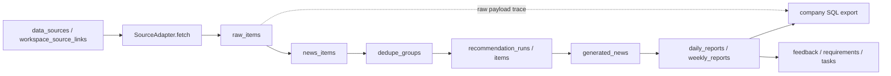
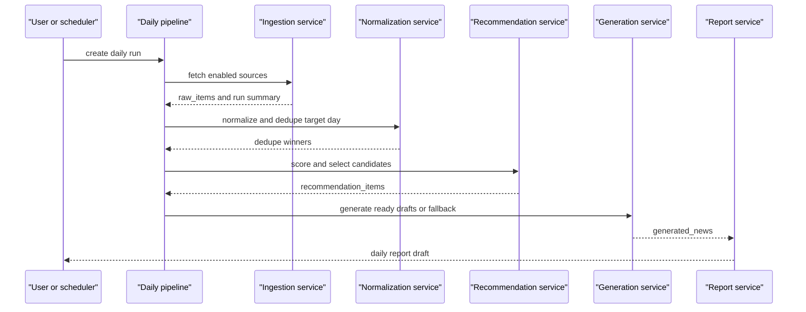

# InfoWatchtower 总纲

本文档是 InfoWatchtower 的唯一总纲。任何工程师或 AI 接手时，先读本文；写代码时遵守 `config/contracts/*.json` 和 `config/taxonomy/*.json`。正式 SDD 总装版见 `docs/software-design-description.md`，其他 `docs/*.md` 是专题附录。

如果只能读一个文档，读本文。

## 1. 产品定位

InfoWatchtower 是规划部的产业情报操作系统，不是单纯新闻站，也不是只服务 AI 板块的日报工具。

它要持续接入外部公开信息、内部补充信息和未来公司内网源，把原始信号保存下来，统一成可去重、可推荐、可编辑、可追溯的情报对象，再沉淀成日报、周报、专题、洞察、内部需求和指派任务。

第一阶段从 AI 板块和公司内部 SQL 导出切入，但底层必须支持后续扩展到硬件、半导体、云基础设施、机器人、政策市场、竞品生态等板块。

长期工作闭环：

```text
外部信号
-> 标准化新闻/情报
-> 去重推荐
-> 编辑判断
-> 洞察 insight
-> 战略含义 implication
-> 机会/风险 opportunity_or_risk
-> 内部需求 requirement
-> 指派任务 task
-> 用户反馈反哺来源和推荐
```

## 2. 当前仓库状态

当前仓库已完成阶段 0-6 可回填闭环，并补齐历史补采二期、抓取覆盖率详情、周报候选采信管理和第一版战略闭环页面。阶段 3 完成旧种子源导入、共享数据源池、默认工作台源链接、工作台统一标签策略、adapter 框架、RSS/paper RSS/页面源抓取到 `raw_items`、工作台级 ingestion run API 和 Redis/RQ worker + scheduler 调度入口；`POST /api/ingestion/backfill-runs` 已能创建 `historical_backfill` run，支持 `rss_window/paper_api/archive_page/sitemap/manual_import` 模式，按目标日期窗口过滤 raw 入库并记录每源覆盖统计，前端 `/ingestion-runs` 可展示常规抓取、补采模式、每源 fetched/created/updated、入窗/窗外/缺日期和失败原因。阶段 4 已完成 `raw_items -> news_items -> dedupe_groups`：`POST /api/news-items/normalize` 可按工作台把已启用源的 raw 标准化成 news，生成 canonical URL、normalized title 和 dedupe key，并按工作台隔离重建硬去重组；`GET /api/news-items` 与 `GET /api/dedupe-groups` 可验收 winner/loser 和追溯 ID。阶段 5 已完成 `POST /api/pipeline/daily-runs`、`POST /api/recommendation/runs`、`GET /api/daily-reports`、日报发布、日报条目编辑和点赞/评分/评论最小 API；日报生成支持 `generation_timeout_seconds`，MiniMax 超时或失败会落为 `fallback_needs_review`，不阻塞整天草稿；`POST /api/daily-reports/{id}/regenerate-generated-news` 可重跑草稿里非 ready 生成稿。周报前后端已提供 `GET/POST /api/weekly-reports`、`GET/POST publish /api/weekly-reports/{id}` 和 `PATCH /api/weekly-report-items/{id}`，可从已发布日报采信条目生成周报候选草稿，并在 `/weekly-reports` 中按成品新闻一级标签形成周报板块，支持板块内采信/剔除、排序、编辑和发布。推荐按 `day_key` 只选目标日 winner，`planning_intel` 默认采用技术情报优先策略，优先论文、研究机构、AI 软件、AI 基础设施、模型工程、推理/训练、RAG、多智能体、Agent 记忆和工程实践，降权融资、财报、宏观产业收入数据、传闻曝光、消费硬件和泛商业市场新闻。`generated_news` 可通过旧参考脚本已验证的 MiniMax 中国区 OpenAI-compatible `chat/completions` 生成；未启用、超时或失败时只生成 `rule_v1:fallback` 草稿并标记 `fallback_needs_review`，不能直接进入标准公司 SQL。阶段 6 已完成标准公司 SQL 导出：已发布日报中 `adoption_status = 2` 且 `generated_news.generation_status = ready`、`generated_by` 非 `rule_v1` 的条目会写出旧系统兼容的 4 表 SQL，`content_json` 只保留五段旧字段，`ai_journal.source_title/content` 导出前清洗为纯文本，原始 HTML 保留在 `raw_items` 追溯层；`GET /api/exports/{export_job_id}/trace` 可按 SQL 语句追到日报条目、生成稿、news、raw 和数据源。`planning_intel` 成品新闻一级标签和公司 SQL category 仍使用旧系统约定的 10 个 AI 标签，来源为 `config/taxonomy/news_categories.json`；`config/taxonomy/source_tags.json` 只作为数据源侧方向标签，用于源管理、覆盖分析和评分先验，不写入 `generated_news.category`。前端 `/daily-reports` 可按日期触发完整流水线并查看日报草稿。`/requirements`、`/tasks`、`/sync`、`/audit-logs` 已从占位路线图升级为真实 API 页面，支持需求/任务创建与状态更新、同步包导出下载、同步导入幂等记录和审计查询；导入侧当前先写 `sync_inbox`，后续再补业务对象 apply handler。scheduler 开启后可按固定北京时间执行每日完整流水线：抓取、标准化/去重、推荐和日报草稿；生产推荐 `INGESTION_SCHEDULER_DAILY_TIME=09:00`、`INGESTION_SCHEDULER_TIMEZONE=Asia/Shanghai`、`DAILY_PIPELINE_DAY_OFFSET_DAYS=-1`，每天早上生成昨天日报；如需旧行为可设置 `SCHEDULER_JOB_MODE=ingestion_only`。`planning_intel` 和 `ai_tools` 的默认标签策略已在后端隔离。内容级准入、抓取覆盖率、周报采信、战略闭环页面、SQL 追溯、同步包骨架和生产部署检查已经进入可验收 v1；当前已补齐 `2026-05-21` 到 `2026-05-27` 的规划部日报发布和公司 SQL 预览，其中 `2026-05-27` 通过当天 RSS/paper RSS 窗口补采新增 72 条 raw/news 后生成 6 条采信项。下一步优先做同步包业务 apply handler、历史补采深化、周报正文生成和真实环境备份恢复演练。

第一轮 Tech Insight Loop 融合已完成源治理和评分器增强：`config/seeds/tech_insight_loop/sources_full_zh.csv` 的 386 行源记录可通过 `POST /api/sources/import-tech-insight-loop` 导入，355 行有 RSS/URL/RSSHub 入口，31 行公众号 `wx://` 等无当前 adapter 入口的记录以 metadata-only 方式保留并标记待补入口；重复 RSS/URL 去重后写入 363 个共享源，不覆盖已有人工启用关系。`config/scoring/content_scorer_v2.json` 已迁入 Tech Insight Loop 评分配置，推荐项持久化 `admission_level/admission_score/admission_pool/noise_types_json/reject_reasons_json/scorer_breakdown_json/expert_routes_json`，前端源页、推荐页和候选池可展示源等级、渠道、专家路由、准入等级和噪声原因；公司 SQL 合同、`generated_news.content_json` 五段结构和规划部 10 类 category 不变。

Tech Insight Loop 第二轮已完成阶段 0 只读资产盘点：`scripts/tech_insight_loop_inventory.py` 以 SQLite `mode=ro` 读取 `references/参考工具/data/insight_loop.sqlite3`，生成 `outputs/tech_insight_loop/tech_insight_loop_inventory.json` 和 `.md` 本地盘点产物，并由 `config/contracts/tech_insight_loop_legacy_import.json` 固化历史导入边界。盘点确认旧库包含 386 个源、14834 条素材、66 份报告、23 个实体、275 条实体大事记、4 条反馈、4 条质量反馈和 257 个旧任务记录；`entity_milestones` 关系完整，`reports.source_article_ids_json` 有 2773 个引用，其中 30 个未能解析到旧 `articles.id/article_id`。该阶段只输出统计、字段质量、关系检查和迁移预览，不写主库，不触发推荐，不进入公司 SQL。

历史素材和报告导入 dry-run 已完成：`scripts/tech_insight_loop_legacy_dry_run.py` 只读规划 `articles/reports` 导入，输出 `outputs/tech_insight_loop/tech_insight_loop_legacy_dry_run.json` 和 `.md`。当前 dry-run 结果显示 14834 条旧素材全部可作为 `raw_items.raw_payload_json.legacy_tech_insight_loop` 历史归档候选，14713 条具备模型字段可作为后续历史 news 草稿候选；66 份旧报告中 45 份 daily 和 13 份 weekly 可进入 `historical_reports` 归档，3 份 brief 和 5 份 brief_ppt 暂不进入本批归档；报告引用 2773 个，已解析 2743 个，未解析 30 个。真实导入前必须继续保留 dry-run 审核步骤。

历史素材和报告真实导入脚本已实现：新增 `historical_reports` 归档表，新增 `scripts/tech_insight_loop_legacy_import.py`，默认不写库，只提示先运行 dry-run；显式传入 `--execute` 且配置 `DATABASE_URL` 后，脚本会创建一个禁用的 `legacy_tech_insight_loop` 归档数据源，将旧素材幂等写入 `raw_items`，完整旧行保存在 `raw_payload_json.legacy_tech_insight_loop`，并将 daily/weekly 旧报告写入 `historical_reports`，报告引用缺口写入 `source_refs_json.unresolved`。导入资产的 `workspace_code` 默认为 `legacy_tech_insight_loop`，不会进入当前 `planning_intel` 推荐、日报或公司 SQL。

历史归档只读 API/UI 已实现：`GET /api/historical-reports/summary`、`GET /api/historical-reports` 和 `GET /api/historical-reports/{id}` 可按日期、报告类型、状态、标题/正文和未解析引用过滤旧日报/周报；前端 `/historical-reports` 提供摘要指标、报告列表、正文查看和引用解析面板。该页面只读，不触发导入、推荐或公司 SQL 导出。

实体大事记归档模型和导入脚本已实现：新增 `tracked_entities` 和 `entity_milestones` 归档表，新增 `scripts/tech_insight_loop_entity_import.py`，默认不写库；显式传入 `--execute` 且配置 `DATABASE_URL` 后，会把旧 `ai_entities` 幂等写入 `tracked_entities`，把旧 `entity_milestones` 写入 `entity_milestones`，并尽量解析到已导入的 `raw_items` 和 `historical_reports`。如果真实库尚未导入历史素材/报告，事件仍可导入，未解析的旧 `article_id/report_id` 会保留在 `metadata_json.legacy_refs`。实体事件仍属于历史/时间线资产，不会修改 `raw_items/news_items/historical_reports`，也不会进入当前推荐、日报或公司 SQL。

实体大事记只读 API/UI 已实现：`GET /api/entity-timeline/summary`、`GET /api/tracked-entities`、`GET /api/entity-milestones` 和 `GET /api/entity-milestones/{id}` 可按实体、事件类型、重要等级、板块、日期和未解析引用过滤；前端 `/entity-milestones` 提供实体列表、事件时间线、详情和旧引用解析面板。该页面只读，不触发导入、推荐、日报/周报采信或公司 SQL 导出。

历史反馈和旧任务归档模型已实现：新增 `historical_feedback_items` 和 `historical_job_runs` 归档表，新增 `scripts/tech_insight_loop_quality_import.py`，默认不写库；显式传入 `--execute` 且配置 `DATABASE_URL` 后，会把旧 `feedback/article_quality_feedback` 幂等写入历史反馈归档，把旧 `jobs` 写入统计型旧任务归档。反馈会尽量解析到已导入的历史 `raw_items`，未解析旧 `article_id` 保留在 `metadata_json.legacy_refs`；旧任务只迁移统计、消息、失败原因和 details，不迁移旧任务状态机，也不会创建当前 `comments/ratings/ingestion_runs`。

历史反馈和旧任务只读 API/UI 已实现：`GET /api/quality-archive/summary`、`GET /api/historical-feedback-items` 和 `GET /api/historical-job-runs` 可查看旧反馈、旧质量反馈、旧任务状态、失败源数量和反馈引用解析状态；前端 `/quality-archive` 提供质量归档面板、反馈筛选、任务筛选和反馈引用缺口抽查。该页面只读，不触发导入，不创建当前评论/评分/抓取任务，不进入推荐、日报/周报采信或公司 SQL。

Tech Insight Loop 导入验收摘要和引用缺口入口已实现：`GET /api/legacy-import/summary` 按当前 InfoWatchtower 主库统计历史素材 raw、历史日报/周报、实体、实体大事记、历史反馈和旧任务记录的实际导入数，并与冻结的旧库基线对齐；`GET /api/legacy-import/gaps` 合并展示 `historical_reports.source_refs_json.unresolved`、`entity_milestones.metadata_json.legacy_refs` 和 `historical_feedback_items.metadata_json.legacy_refs` 中未解析的旧素材/报告引用。前端 `/historical-reports` 顶部已提供导入验收面板。命令行执行验收脚本 `scripts/tech_insight_loop_import_verify.py` 已补齐，可 `--check-only` 只读核对当前库，也可用小 limit 执行导入后输出 `outputs/tech_insight_loop/tech_insight_loop_import_execution_report.{json,md}`；需要同时导入历史反馈和旧任务归档时显式加 `--include-quality-archive`，无 limit 的全量执行必须显式传入 `--confirm-full-import`。该入口只读，不执行导入脚本，不修改归档资产，不触发推荐、采信或公司 SQL。

工作台级抓取已经支持并发池和单源超时：默认 `INGESTION_CONCURRENCY=8`、`INGESTION_SOURCE_TIMEOUT_SECONDS=25`，API 可用 `concurrency` 和 `source_timeout_seconds` 覆盖。这样几百个数据源不会因为少数慢源被串行阻塞，抓取结果仍按源顺序串行入库，保留幂等写入和运行摘要。

文档维护规则见 `docs/README.md`。修改设计时必须同步总纲、对应模块文档和相关 `config/contracts/*.json`，不要形成两套实现口径。

仓库分层：

```text
config/
  contracts/             机器可读契约
  domain_packs/          后续板块扩展配置包
  seeds/legacy/          旧系统种子源，可导入新系统
  taxonomy/              新闻一级标签、数据源方向标签与长期产业情报板块
docs/
  00-system-design.md    唯一总纲
  *.md                   专题附录
references/
  README.md              私有参考仓拉取说明
```

旧 `.env` 已复制到本地 `config/.env`，但被 `.gitignore` 忽略，不提交 Git。

### 2.1 当前已验证输出

当前本地库已经能生成规划部工作台的日报草稿、发布日报并导出公司 SQL 预览。已验证过的本地输出包括：

- `2026-04-30` 单日日报与公司 SQL 预览。
- `2026-05-01` 到 `2026-05-08` 批量日报与合并 SQL 预览。
- `2026-05-09` 到 `2026-05-19` 已按质量门整理日报采信项并生成合并 SQL 预览；`2026-05-15` 到 `2026-05-19` 新增单日预览和合并预览。
- 生成稿字段固定为 `background/effects/eventSummary/technologyAndInnovation/valueAndImpact`。
- SQL 导出每条采信新闻固定生成 `ai_journal`、`ai_journal_focus`、`ai_journal_analysis`、`t_news_data_info` 四类语句，category 写入 `generated_news.category`，即规划部 AI 十分类。
- 导出的 `focus_id` 第一版默认 `1`，`adoption_status` 默认 `2`，日期按日报 `day_key` 对齐。
- 导出前会清洗 `ai_journal.source_title/content` 的 HTML；原始 HTML 仍保留在 `raw_items` 追溯层。
- SQL 文件头统一为 `InfoWatchtower Company SQL Preview`；所有预览 SQL 导入内网前必须运行 `python3 scripts/validate_company_sql.py`，该脚本以 `2026-05-05` 预览为基准逐字段校验。
- `2026-05-15` 到 `2026-05-19` 的 SQL 预览已通过校验；质量门会把偏商业、偏生活、招聘、价格和公益活动类噪声降为非采信，标准 SQL 只导出 MiniMax `ready` 的采信项。
- `2026-05-21` 到 `2026-05-27` 已补齐日报发布和公司 SQL 预览：`2026-05-21` 到 `2026-05-26` 每天 10 条采信项，`2026-05-27` 通过 RSS/paper RSS 当前窗口补采新增 72 条 raw/news 后生成 6 条采信项；全部导出采信项均为 MiniMax `ready`，且单日 SQL 和 `planning_intel_2026-05-21_to_2026-05-27_company_sql_preview.sql` 均已通过 `scripts/validate_company_sql.py`。

本地 SQL 预览文件放在 `outputs/sql/previews/`，该目录被 `.gitignore` 忽略，不随主仓提交。主仓只提交生成逻辑、字段契约和文档。

### 2.2 当前明确缺口

“规划部工作台全量启用 294 个共享源”和“某一天有多少候选”不是同一个指标。候选数量经过这些过滤：

```text
工作台启用源
-> 抓取成功
-> feed 当前窗口里有条目
-> 条目发布时间落在目标 day_key
-> raw 标准化成 news
-> 去重后保留 active winner
-> 推荐层选择
```

因此，如果某天只有少量候选，首先要排查抓取覆盖率、失败源、源本身是否当天发布、RSS 是否保留历史条目，以及历史补采是否可用，而不是直接归因于推荐器漏选。

下一阶段必须继续补齐，按优先级推进：

1. P0 SQL 导出增强：当前已支持选择已发布日报、查看导出历史、预览和下载 SQL，并通过 trace API 从 SQL 语句追溯到 daily item、generated news、news item、raw item 和 source；下一步补导出前字段长度、URL 长度和 HTML 污染校验摘要。
2. P0 公网/内网部署与登录安全：当前已有生产 Compose、Caddy 反向代理、生产 env 模板和部署检查脚本；下一步补真实服务器备份恢复演练、登录限流、默认密码治理、Google OIDC 预留和公司 IDaaS code flow adapter 预留。
3. P0 同步包能力：当前 `/sync` 已能导出同步包、下载 zip、导入到 `sync_inbox` 做幂等记录并写审计；后续补业务表 apply handler、冲突检查和同步审计细化；继续坚持公网公开信号向内网同步，内网用户反馈默认不回流公网。
4. P1 历史补采深化：当前已支持 `rss_window/paper_api/archive_page/sitemap/manual_import` 运行模式和覆盖率统计；后续要把论文 provider、归档页分页、sitemap 深挖、失败源重试和手工 CSV 上传做成完整可验收体验。`rss_window` 仍只代表当前 feed 窗口恢复，不等同全站历史归档抓取。
5. P1 周报增强：当前周报 v1 管理采信项和按一级标签分板块；下一步补热度/反馈排序、自动周报正文、周报导出，以及必要时增加不影响公司 SQL category 的 weekly section 映射层。
6. P1 战略闭环深化：当前 requirement/task 有真实 API 页面和审计；下一步从已发布日报/周报条目沉淀 insight、requirement 和 task，并让任一内部需求可追溯到外部原始信号。
7. P2 候选池运营增强：当前已展示去重 winner、loser、来源覆盖、推荐分、日报采信状态和追溯 ID；下一步补筛选、采信入口、批量操作和更清晰的质量治理字段。
8. P2 抓取覆盖率深化：当前已具备 ingestion/backfill run 摘要、每源明细和 raw/news/winner/recommendation/daily 目标日覆盖漏斗；下一步补失败源重试、长期覆盖趋势和异常告警。
9. P2 新板块/domain pack 样例：以硬件、半导体、云基础设施等方向补一个 domain pack 样例，证明新增板块不需要改主链路。
10. P2 Tech Insight Loop 历史资产导入：历史素材/报告导入脚本、实体大事记导入脚本、历史反馈/质量反馈/旧任务归档脚本、历史报告只读归档页、实体大事记只读页、质量归档只读页、导入验收摘要、引用缺口入口和命令行执行验收脚本已完成；下一步在配置 `DATABASE_URL` 的真实数据库上跑小批量/全量导入验收。所有历史资产默认归档状态，必须保留旧行追溯，不自动进入当前推荐、日报和公司 SQL。

## 3. 第一版范围

第一版必须跑通：

- 公网账号密码登录。
- 内网可信 header 登录预留。
- 旧种子源导入。
- RSS 抓取。
- raw 原始数据入库。
- `news_items` 标准化。
- URL/标题日期去重。
- 推荐评分。
- 日报草稿。
- 管理员采信、编辑、发布。
- 点赞、评分、评论。
- 公司 SQL 导出。
- 最小 insight / requirement / task 闭环。
- 单台服务器 Docker Compose 部署。

第一版可以只做骨架或轻实现：

- wiseflow adapter。
- 页面监控 adapter 的深度抽取和增量差异识别。
- 论文 API / 论文页面源。
- 周报自动生成。
- 多环境同步。
- domain pack 扩展。

这些骨架必须预留，不能把系统写死成 RSS + AI 日报。

## 4. 技术选型

定稿选型：

- 后端：Python FastAPI。
- 数据库：PostgreSQL。
- ORM / 迁移：SQLAlchemy + Alembic。
- 前端：Vue 3 + TypeScript + Vite。
- 部署：单仓 monorepo + Docker Compose。
- 后台任务：第一版可用 APScheduler 或 RQ/Celery + Redis。

建议代码目录：

```text
backend/
  app/
    adapters/
    auth/
    core/
    dedupe/
    exports/
    ingestion/
    models/
    reports/
    scoring/
    workers/
  alembic/
  tests/
frontend/
  src/
deploy/
  docker-compose.prod.yml
  Caddyfile or nginx.conf
```

### 4.1 SDD 设计方法与白盒评价口径

AI情报官按 SDD 思路组织设计材料：先确定系统目标和边界，再定义主数据流、核心对象、接口、存储、权限、部署、质量约束和扩展点。本文作为总设计文档，`docs/software-design-description.md` 作为 SDD 总装版；专题设计分散在 `docs/api-and-ui-implementation.md`、`docs/ingestion-adapter-dedup-spec.md`、`docs/data-format-mapping.md`、`docs/data-lineage-and-storage.md`、`docs/extension-points.md`、`docs/auth-security-roadmap.md` 和 `docs/multi-environment-sync.md`。

设计方法：

1. 先固定旧系统和内网 SQL 合同，再实现新系统主链路，避免字段漂移。
2. 先保存完整原始数据，再做标准化、去重、推荐和报告编辑，保证可追溯。
3. 通过 `config/contracts/*.json` 固化字段和流程边界，通过 `config/taxonomy/*.json` 固化标签口径。
4. 把数据源、评分、生成、导出、登录和同步做成可扩展点，新增方向不改主链路。
5. 前端只处理操作和呈现，报告字段、SQL 字段和推荐准入由后端服务和配置统一控制。

DFX 设计：

| 类型 | 设计约束 | 工程落点 |
| --- | --- | --- |
| 功能性 | 覆盖信源管理、抓取、补采、去重、推荐、日报、周报、SQL 导出和历史归档 | `backend/app/api/routes`、`frontend/src/pages` |
| 性能 | 多源抓取支持并发池和单源超时，避免慢源阻塞整批任务 | `backend/app/ingestion/runs.py`、`INGESTION_CONCURRENCY` |
| 可靠性 | 原始 payload 不覆盖，日报编辑只写报告层，SQL 导出前做字段校验 | `raw_items.raw_payload_json`、`scripts/validate_company_sql.py` |
| 安全性 | 密钥不入库不入 Git，登录、权限、IDaaS 和同步边界独立设计 | `docs/auth-security-roadmap.md`、`docs/auth-unified-login.md` |
| 可维护性 | 文档、契约、样例和校验脚本同步维护 | `AGENTS.md`、`docs/README.md`、`config/contracts` |
| 可扩展性 | Adapter、scorer、exporter、auth adapter、domain pack 可替换或新增 | `docs/extension-points.md` |
| 可测试性 | 后端 pytest、前端 build、SQL 专项校验可单独运行 | `backend/tests`、`.github/workflows/ci.yml` |

主链路架构图：



日报生成时序：



主要设计模式和复用点：

- Adapter：`SourceAdapter` 屏蔽 RSS、页面、论文、手工导入等来源差异。
- Strategy / configuration：推荐准入和评分规则从 `config/scoring/content_scorer_v2.json` 读取，减少硬编码。
- Exporter：公司 SQL 导出逻辑集中在 `backend/app/exports/company_sql.py`，与日报编辑隔离。
- Builder：周报从已发布日报采信项构建候选，不直接修改日报和生成稿。
- Repository-like service layer：路由层只处理请求和响应，业务规则集中在 ingestion、recommendations、reports、exports 等服务模块。
- Open/Closed：新增 source adapter、domain pack、评分配置或导出方式时优先新增模块和配置，不修改主链路合同。

## 5. 主数据流

统一主链路：

```text
data_sources 共享源池
-> workspace_source_links 工作台启用和配置
-> SourceAdapter.fetch()
-> raw_items
-> content extraction
-> news_items
-> dedupe_groups / dedupe_group_items
-> candidate pool
-> recommendation_runs / recommendation_items
-> generated_news
-> daily_reports / daily_report_items
-> feedback / comments / ratings
-> insights / requirements / tasks
-> company SQL export
```

关键原则：

- adapter 只负责接入和保存原始数据，不做最终推荐和日报采信。
- 原始 payload 必须完整进入 `raw_items.raw_payload_json`。
- 去重在 `news_items` 之后、推荐之前。
- `dedupe_groups` 按 `workspace_code + dedupe_key` 隔离；同一条共享 raw 可以被不同工作台各自标准化和去重。
- 候选池是去重后的代表项工作池，不是新数据源，也不是日报。
- 推荐只处理去重 winner。
- 日报编辑不覆盖 `raw_items` 和 `generated_news`，只写报告层 editor override。
- 标准公司 SQL 只导出已发布日报中 `daily_report_items.adoption_status = 2` 的条目。
- 任意内部需求必须能追溯回触发它的外部原始信号。

## 6. 核心对象

核心表族：

```text
workspaces / workspace_sections / workspace_memberships
data_sources / workspace_source_links
label_sets / labels / content_labels
raw_items
news_items
dedupe_groups / dedupe_group_items
recommendation_runs / recommendation_items
generated_news
daily_reports / daily_report_items
weekly_reports / weekly_report_items
reactions / ratings / comments / editorial_actions
insights / strategic_implications / requirements / topic_tasks
export_jobs / export_job_items
users / roles / permissions / audit_logs
```

支持长期扩展的核心横切字段：

```text
workspace_code          所属工作台，如 planning_intel
domain_code             所属板块，如 ai/hardware/semiconductor
visibility_scope        public/internal/restricted
sync_policy             none/public_to_intranet/two_way_config/manual_only
global_id               跨环境同步稳定 ID
origin_instance_id      首次创建实例
revision/content_hash   同步和冲突处理
```

工作台、板块、模块和数据源共享是四个不同概念：

```text
workspace_code          选择工作范围和权限边界
section_key/module_key  数据库注册的核心页面或可选插件页面
domain_code             选择情报内容的主题板块
data_sources            全局共享源池
workspace_source_links  某工作台启用了哪些共享源以及如何配置
```

示例：

- 工作台列表来自 `workspaces`，不是前端写死。
- 工作台页面来自 `workspace_sections`，默认只启用数据源管理、候选池、日报、周报、SQL 导出、用户权限、审计。
- 多个工作台可以复用同一个 RSS、wiseflow 或论文源；复用关系写在 `workspace_source_links`。
- 每个工作台的数据源管理页配置工作台统一一级/二级标签策略；单个源只配置启用、权重、日限和抓取相关信息。
- `domain_code=ai` 和 `domain_code=hardware` 是内容板块，不是工作台。

规则：

- 不要把 `domain_code` 当成 UI 工作台边界。
- 不要为了任何新工作台另起一个前后端仓库。
- 不要给每个工作台复制一套数据源或标签结构。
- 不要默认显示工具目录、工具任务或独立热点专题页面；这些只有在 `workspace_sections.enabled=true` 后才可出现。
- 第一版的“工具目录”含义由一级/二级标题配置承担，不新增工具管理页面。
- 新工作范围走 `workspaces`；共享源复用走 `workspace_source_links`；新主题板块走 domain pack；新标签体系走 `label_sets`。

最小追溯链路：

```text
daily_report_items
-> generated_news
-> recommendation_items
-> dedupe_group_items
-> news_items
-> raw_items
-> data_sources
```

战略闭环追溯：

```text
requirements
-> strategic_implications
-> insights
-> news_items
-> raw_items
```

## 7. Adapter 契约

每种数据源通过 adapter 接入。第一版源类型：

```text
wiseflow
rss
paper_rss
page_monitor
page_manual
crawler
paper_api
paper_page
manual
internal
```

每条进入系统的原始记录，adapter 至少输出：

```text
data_source_id
domain_code
visibility_scope
sync_policy
source_type
source_name
entry_key
source_title
fetched_at
raw_payload_json
```

进入去重推荐链路时，`news_items` 至少满足：

```text
source_url / canonical_url
```

或：

```text
source_title + published_at/created_at
```

缺 URL、标题和时间的记录只能进入 `raw_items`，不能进入推荐。

## 8. 去重与推荐

第一版只做保守硬去重：

- 有 URL 时：`dedupe_key = "url:" + canonical_url`。
- 无 URL 时：`dedupe_key = "title:" + normalized_title + "|date:" + yyyy-mm-dd`。

canonical URL 规则：

- scheme 和 host 小写。
- 去掉 fragment。
- path 去掉末尾 `/`。
- 去掉 `utm_*`、`spm`、`ref`、`ref_src`、`fbclid`、`gclid` 等追踪参数。

winner 选择顺序：

1. 有 URL。
2. wiseflow legacy bonus。
3. 官方源/可信源。
4. 正文更完整。
5. 发布时间更新。

当前实现 API：

```text
POST /api/news-items/normalize
GET  /api/news-items
GET  /api/dedupe-groups
```

推荐分数必须可解释：

```text
quality_score
topic_score
freshness_score
feedback_score
diversity_score
source_score
heat_score
final_score
recommendation_reason
```

`planning_intel` 的默认推荐口径是“AI 技术能力和 AI 工程能力优先”，不是商业资讯优先。推荐层先做内容准入，再做日报选择：

- P0/P1：强相关技术信号，优先进入日报。
- P2：中价值观察信号，可在日报预算未满时进入，也可用于周报/观察池。
- P3：低价值或背景信息，默认只检索可见。
- R：噪声或离题内容，默认不进入日报。

评分会提升 AI 软件与基础设施、模型工程、推理/训练、RAG、多智能体、Agent 记忆、评测基准、开源框架、硬件厂商技术路线、友商技术动态、AI 芯片、GPU 集群、数据中心架构、通信系统和标准进展等信号。数据源侧方向标签只能作为弱先验，不能因为“这个源是厂商源/硬件源”就直接入日报；单条内容仍必须出现架构、推理、模型服务、芯片、数据中心、通信系统、标准或工程实现证据。融资、财报、股价、采购/中标/集采、消费硬件、活动预告、宣传推广会/品牌行动、泛商业合作、纯营销、航天火箭等离题工程新闻、纯市场新闻、法律/版权元讨论、标题党、社会/教育离题内容和离题生物医学/纯学术论文默认降权。日报选择还会限制单源、论文源（默认约 10%）和单一内容池的占比，`P2` 只作为无噪声且有明确技术信号的补位项，`P2 paper_rss` 默认不进入日报，避免内容被某一类来源刷屏。用户反馈和管理员采信后续仍可反哺 `heat_score/feedback_score/source_score`。

## 9. 分类与板块扩展

`planning_intel` 当前成品新闻一级标签必须沿用旧系统约定的 AI 十分类，来源是 `config/taxonomy/news_categories.json`。这 10 个标签进入模型生成稿 `generated_news.category`、日报展示和公司 SQL category。

新的方向/板块标签只在数据源侧使用，来源是 `config/taxonomy/source_tags.json`。它们用于描述一个信息源可能覆盖哪些方向，服务于源过滤、覆盖分析、推荐先验和后续内容准入，但不能替代成品新闻一级标签。长期领域扩展由 `config/taxonomy/intelligence_domains.json` 和 domain pack 承载：

```text
config/domain_packs/{domain_code}/
  sources.json
  taxonomy.json
  scoring.json
  report_templates.json
  export_mapping.json
```

新增硬件、半导体、政策、竞品板块时，加 domain pack，不改主链路。

每个 `data_sources`、`raw_items`、`news_items` 都必须带 `domain_code`。旧系统导入默认 `domain_code = ai`。

## 10. 登录与权限

公网和内网共用一套本地用户、角色、权限和审计模型。外部认证只证明“这个人是谁”，InfoWatchtower 的 RBAC 决定“这个人能做什么”。

第一版认证模式：

```text
local
public_password
intranet_header
```

统一流程：

```text
AuthAdapter
-> ExternalIdentity
-> IdentityResolver
-> users
-> session/JWT
-> RBAC
```

公网默认：

```text
AUTH_MODE=public_password
AUTH_AUTO_PROVISION=false
```

内网快速接入：

```text
AUTH_MODE=intranet_header
AUTH_HEADER_EMPLOYEE_NO=X-Employee-No
AUTH_HEADER_DISPLAY_NAME=X-Employee-Name
AUTH_AUTO_PROVISION=true
```

`intranet_header` 只能部署在可信网关后面，后端不能被用户绕过网关直接访问。

## 11. 部署与同步

第一版推荐单台服务器 Docker Compose：

```text
reverse_proxy
frontend static files
backend FastAPI
worker
scheduler
postgres
redis
```

数据库不放 GitHub。单机部署时 PostgreSQL 数据在服务器磁盘或 Docker volume，例如：

```text
/srv/infowatchtower/postgres_data
```

默认不暴露数据库端口。公网只开放：

```text
22 / 80 / 443
```

公网和内网不分叉代码，差异通过 `.env.production`、`AUTH_MODE`、域名、密钥和同步开关控制。

长期两库方案：

```text
public DB      公开信息采集、raw/news/recommendation
intranet DB    内部用户、评论、采信、需求、任务、公司 SQL 导出
```

推荐应用层 outbox/inbox 同步，不做混乱双写。公网可以向内网同步公开信号；内网用户、评论、需求、任务默认不回流公网。

同步前必须检查 `visibility_scope` 和 `sync_policy`。密钥、token、cookie 只允许用 `credential_ref` 引用，不进入同步包和 Git。

## 12. 公司 SQL 导出

标准导出范围：

```text
daily_reports.status = published
daily_report_items.adoption_status = 2
```

每条日报新闻固定导出 4 条 SQL，顺序不可变：

1. `ai_journal`
2. `ai_journal_focus`
3. `ai_journal_analysis`
4. `t_news_data_info`

字段映射以 `config/contracts/news_sql_mapping.json` 为准。标准模式 `export_category_mode = news_primary`，`ai_journal_analysis.category` 与 `t_news_data_info.category` 直接使用 `generated_news.category`，而 `planning_intel` 的 `generated_news.category` 必须属于旧系统约定的 10 个 AI 一级标签。

当前实现入口是 `backend/app/exports/company_sql.py` 和
`POST /api/exports/company-sql/daily-reports/{daily_report_id}`。导出前必须发布日报；导出时可使用日报编辑层覆盖标题、摘要、关键词和五段正文，但公司 SQL 的 `content_json` 只包含旧系统五段正文，不包含 InfoWatchtower 自己的追溯字段。

日期字段是内网导入硬契约。`ai_journal.created_at` 与
`ai_journal_analysis.created_at` 必须保留旧系统同款列顺序和日期字面量样式，输出为
`'YYYY-MM-DD HH:MM:SS'`。优先使用原始发布时间并按北京时间 `Asia/Shanghai` 渲染，以匹配日报 `day_key` 的归属口径；如果来源缺失发布时间，标准日报 SQL
导出兜底为 `daily_reports.day_key 09:00:00`，不写 `NULL`。不要改成
`STR_TO_DATE(...)`、`CAST(...)`，也不要省略 `ai_journal_analysis.created_at`；如果内网前端触发
`.strftime()` 报错，应排查内网表字段类型、ORM 类型和导入后实际行值，而不是擅自改变 SQL 导出契约。

导出到 `ai_journal.source_title` 和 `ai_journal.content` 前必须做纯文本清洗，去除 HTML 标签和 script/style 内容；`raw_items.raw_payload_json` 与 `raw_items.raw_content` 仍保留原始抓取内容，用于回溯和重新处理。

## 13. 旧系统事实

当前已归档的旧系统事实：

- Wiseflow 原始源：1 个。
- RSS 源：108 个，其中 74 个启用、34 个停用。
- 页面源：4 个。
- 合并索引：113 个。
- 论文 RSS 源：17 个，其中 14 个启用。
- 用户补充信息源台账：`config/seeds/legacy/source_catalog/information_source_registry_20260511.csv`，351 行，其中 248 条标准 RSS 记录可导入。
- 当前导入器合并旧种子和补充台账后处理 361 条记录，按 URL 去重后形成 294 个共享数据源；规划部工作台 v1 默认全部启用。补充台账里的状态/纳入建议保留在源元数据里做评分先验，不作为初始停用开关。
- 成品新闻一级标签：10 个，见 `config/taxonomy/news_categories.json`。
- 数据源方向标签：见 `config/taxonomy/source_tags.json`，只作为源侧标签化和评分先验。
- 每条公司 SQL 导出新闻固定写 4 类 SQL。

完整旧系统参考资料放在私有仓 `InfoWatchtower-References`，只用于查旧系统事实，不作为新代码运行入口。主仓后续可以公开，私有参考资料不随主仓发布。

## 14. 接下来怎么开发

先读：

1. `docs/implementation-handoff.md`
2. `docs/01-implementation-plan.md`
3. `docs/data-examples.md`
4. `docs/README.md`
5. `config/contracts/*.json`

当前第一版主链路已经进入可回填闭环。接下来开发不再从空骨架开始，而是在以下已实现基础上继续加厚：

```text
FastAPI + PostgreSQL + Alembic + Redis/RQ + scheduler
users/auth/RBAC + intranet_header 预留
data_sources import + 294 个规划部共享源默认启用
RSS/paper RSS/page/manual/wiseflow adapter 框架
raw_items -> news_items -> dedupe_groups -> recommendation -> generated_news
daily report draft/publish/edit/feedback
weekly report candidate adoption v1
company SQL export + validate_company_sql.py
ingestion/backfill coverage funnel
requirements/tasks/sync/audit v1
```

## 15. 附录索引

- `docs/implementation-handoff.md`：开发任务书和验收标准。
- `docs/01-implementation-plan.md`：第一版施工顺序、阶段交付物和验收命令。
- `docs/README.md`：文档地图、单一事实源和修改规则。
- `docs/data-examples.md`：数据流样例。
- `docs/ingestion-adapter-dedup-spec.md`：采集和去重细节。
- `docs/data-format-mapping.md`：三层数据映射和 SQL 映射。
- `docs/data-lineage-and-storage.md`：存储、追溯和审计。
- `docs/api-and-ui-implementation.md`：后端 API、前端页面和验收。
- `docs/auth-unified-login.md`：公网/内网统一登录。
- `docs/deployment-ops.md`：部署、自动发布和备份。
- `docs/multi-environment-sync.md`：多环境与多数据库同步。
- `docs/extension-points.md`：扩展点。
- `docs/feedback-heat-scoring.md`：反馈、热度和来源评分。
- `docs/legacy-system-spec.md`：旧系统关键规格。
- `docs/strategic-intelligence-platform.md`：愿景展开附录。
