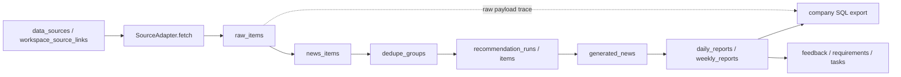
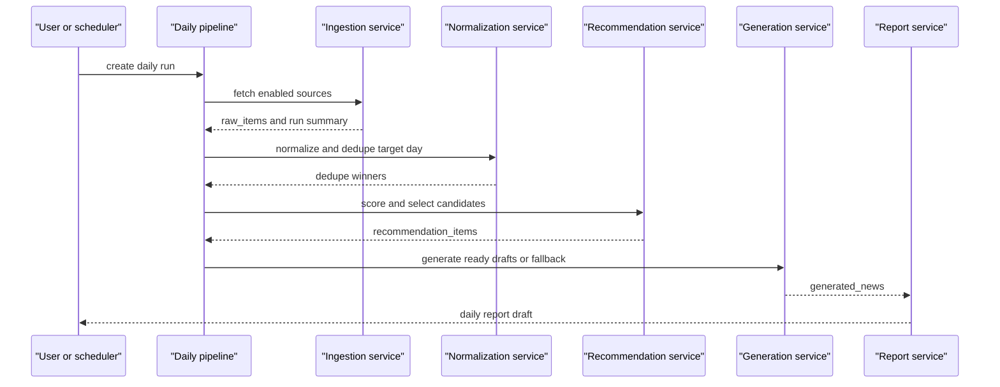

# InfoWatchtower 总纲

本文档是 InfoWatchtower 的唯一总纲。任何工程师或 AI 接手时，先读本文；写代码时遵守
`config/contracts/*.json` 和 `config/taxonomy/*.json`。正式 SDD 总装版见
`docs/architecture/software-design-description.md`；其他设计文档按 `docs/README.md`
归入 `architecture/`、`product/`、`backend/`、`deployment/`、`implementation/`
和 `reference/`，不能混读为同一层级。

如果只能读一个文档，读本文。

## 0. 文档定位

本文只定义产品/业务目标态和不可破坏的系统边界。更细的设计按层归位：

- 前端页面、导航、顶部栏和用户旅程：`docs/product/frontend-product-design.md`
- 前端逐页目标、已做/未做和测试看护：`docs/product/page-specs/frontend-page-specs.md`
- 后端领域模块、数据归属、API/任务/事件：`docs/backend/backend-module-design.md`
- 数据抓取、流转、raw/news、去重、覆盖率：`docs/backend/data-ingestion-flow-storage-design.md`
- 推荐准入、评分、推荐 run、反馈反哺：`docs/backend/recommendation-scoring-design.md`
- 流水线编排、后台任务、scheduler、工作台调度策略、重试：`docs/backend/pipeline-jobs-design.md`
- 生成模型 provider 配置、工作台生成策略、连通性自检：`docs/backend/generation-provider-design.md`
- 日报/周报采信、编辑、发布、锁定：`docs/backend/reports-editorial-design.md`
- 工作台配置、sections、策略、成员：`docs/backend/workspace-configuration-design.md`
- 身份、用户、权限、SSO、membership：`docs/backend/identity-access-design.md`
- 评论、点赞、评分、活动事件、通知：`docs/backend/collaboration-notification-design.md`
- 洞察、战略含义、需求、任务和外部信号追溯：`docs/backend/strategy-loop-design.md`
- 历史报告、实体大事记、质量归档和旧资产导入验收：`docs/backend/archive-knowledge-design.md`
- 同步冲突、分发、人工处置：`docs/backend/sync-conflict-distribution-design.md`
- SQL 导出预检、合规、trace：`docs/backend/export-compliance-design.md`
- 审计日志、运行状态、告警、备份恢复和验收证据：`docs/backend/audit-ops-observability-design.md`
- 全局检索和顶部搜索恢复条件：`docs/backend/search-design.md`
- 密钥、cookie、CSRF、trusted header、同步脱敏和隐私边界：`docs/backend/security-secrets-privacy-design.md`
- adapter、domain pack、report format、auth provider 和可选页面扩展治理：`docs/backend/extension-governance-design.md`
- contract、schema、前后端测试、假控件拦截和 CI 门禁：`docs/backend/contract-test-governance-design.md`
- 部署拓扑、内网 iframe、extranet feed / intranet pull：`docs/deployment/deployment-topology.md`
- 当前实现状态、缺口和证据：`docs/architecture/capability-map.md`
- 字段、枚举、同步对象和接口边界：`config/contracts/*.json`

如果本文和专题文档冲突，先按 `docs/README.md` 的权威关系修正文档，再实现代码。
如果自然语言文档和 `config/contracts/*.json` 冲突，开发前必须同步修正两者。

## 1. 产品定位

InfoWatchtower 是规划部的产业情报操作系统，不是单纯新闻站，也不是只服务 AI 板块的日报工具。

它要持续接入外部公开信息、内部补充信息和未来公司内网源，把原始信号保存下来，统一成可去重、可推荐、可编辑、可追溯的情报对象，再沉淀成日报、周报、专题、洞察、内部需求和指派任务。

第一阶段从 AI 板块和公司内部 SQL 导出切入，但底层必须支持后续扩展到硬件、半导体、云基础设施、机器人、政策市场、竞品生态等板块。

长期工作闭环：

```text
外部信号
-> 标准化新闻/情报
-> 去重推荐
-> 编辑判断
-> 洞察 insight
-> 战略含义 implication
-> 机会/风险 opportunity_or_risk
-> 内部需求 requirement
-> 指派任务 task
-> 用户反馈反哺来源和推荐
```

## 2. 状态索引和目标态部署架构

当前实现状态、证据路径和差距列表以 `docs/architecture/capability-map.md` 为准；
阶段施工顺序和验收命令以 `docs/implementation/01-implementation-plan.md` 为准；
本地验证输出、SQL 预览和历史导入证据属于 `outputs/` 与实施文档，不进入总纲。

本文只保留目标态判断需要的部署硬约束：

本轮澄清后的目标态不是“公网和内网各部署一份同功能系统”，而是同一套代码按部署形态收敛能力：

```text
standalone 本地
  git clone -> deploy/install.sh -> docker compose
  管理员本地导入源、配置能力、抓取、生成和导出。

cloud 云官方
  单台云主机或托管环境部署，管理员采集，非管理员默认 viewer。
  适合给团队看结果和做轻量协作，不负责对内网下发。

extranet 外网发布者
  支持 OIDC/SSO，开启采集和成稿能力。
  对 intranet 暴露 GET /api/sync/feed*，只用 service token，不用用户 cookie。

intranet 内网嵌入
  DEPLOY_MODE=intranet，capability_ingestion=false。
  被内部门户用同站反向代理 iframe 嵌入，外层网关注入工号/姓名/部门 header。
  评论、点赞、评分、采信、需求和任务都落在内网本地库，永不回流外网。
  不跑 wx-cli/公众号/外网 crawler；只通过 sync pull 从 extranet 拉公开源、raw/news、生成稿、日报和周报。
```

这四种形态都共用同一套业务表、RBAC、工作台模型和公司 SQL 出口合同。差异只由 `DEPLOY_MODE`、能力开关、认证 adapter、同步角色和部署网关决定，不能分叉代码。实现级规格见 `docs/deployment/deployment-topology.md`，机器契约见 `config/contracts/deployment_modes.json` 和 `config/contracts/sync_strategy.json`。

## 3. 第一版范围

第一版必须跑通：

- 公网账号密码登录。
- 内网可信 header 登录预留。
- 旧种子源导入。
- RSS 抓取。
- raw 原始数据入库。
- `news_items` 标准化。
- URL/标题日期去重。
- 推荐评分。
- 日报草稿。
- 管理员采信、编辑、发布。
- 点赞、评分、评论。
- 公司 SQL 导出。
- 最小 insight / requirement / task 闭环。
- 单台服务器 Docker Compose 部署。

第一版可以只做骨架或轻实现：

- wiseflow adapter。
- 页面监控 adapter 的深度抽取和增量差异识别。
- 论文 API / 论文页面源。
- 周报自动生成。
- 多环境同步。
- domain pack 扩展。

这些骨架必须预留，不能把系统写死成 RSS + AI 日报。

## 4. 技术选型

定稿选型：

- 后端：Python FastAPI。
- 数据库：PostgreSQL。
- ORM / 迁移：SQLAlchemy + Alembic。
- 前端：Vue 3 + TypeScript + Vite。
- 部署：单仓 monorepo + Docker Compose。
- 后台任务：第一版可用 APScheduler 或 RQ/Celery + Redis。

建议代码目录：

```text
backend/
  app/
    adapters/
    auth/
    core/
    dedupe/
    exports/
    ingestion/
    models/
    reports/
    scoring/
    workers/
  alembic/
  tests/
frontend/
  src/
deploy/
  docker-compose.prod.yml
  Caddyfile or nginx.conf
```

### 4.1 SDD 设计方法与白盒评价口径

AI情报官按 SDD 思路组织设计材料：先确定系统目标和边界，再定义主数据流、核心对象、接口、存储、权限、部署、质量约束和扩展点。本文作为产品/业务总纲，`docs/architecture/software-design-description.md` 作为 SDD 总装版；专题设计必须先按 `docs/README.md` 和 `docs/architecture/design-governance.md` 判定层级，再进入 `docs/product/`、`docs/backend/`、`docs/deployment/`、`docs/implementation/` 或 `docs/reference/` 的对应事实源、附录或运行手册，不能回到一组平铺设计文档。

当前分层事实源以本节开头的文档定位为准。以下 SDD 设计方法说明原则，不再作为
后端模块或前端页面细节的唯一事实源。

设计方法：

1. 先固定旧系统和内网 SQL 合同，再实现新系统主链路，避免字段漂移。
2. 先保存完整原始数据，再做标准化、去重、推荐和报告编辑，保证可追溯。
3. 通过 `config/contracts/*.json` 固化字段和流程边界，通过 `config/taxonomy/*.json` 固化标签口径。
4. 把数据源、评分、生成、导出、登录和同步做成可扩展点，新增方向不改主链路。
5. 前端只处理操作和呈现，报告字段、SQL 字段和推荐准入由后端服务和配置统一控制。

DFX 设计：

| 类型 | 设计约束 | 工程落点 |
| --- | --- | --- |
| 功能性 | 覆盖信源管理、抓取、补采、去重、推荐、日报、周报、SQL 导出和历史归档 | `backend/app/api/routes`、`frontend/src/pages` |
| 性能 | 多源抓取支持并发池和单源超时，避免慢源阻塞整批任务 | `backend/app/ingestion/runs.py`、`INGESTION_CONCURRENCY` |
| 可靠性 | 原始 payload 只被同源同 entry_key 重抓刷新为最新抓取快照（幂等 upsert 刷新语义）；编辑/标准化/推荐/成稿等下游环节永不回写 raw 层；日报编辑只写报告层，SQL 导出前做字段校验 | `raw_items.raw_payload_json`、`scripts/validate_company_sql.py` |
| 安全性 | 密钥不入库不入 Git，登录、权限、IDaaS 和同步边界独立设计 | `docs/deployment/auth-security-roadmap.md`、`docs/deployment/auth-unified-login.md` |
| 可维护性 | 文档、契约、样例和校验脚本同步维护 | `AGENTS.md`、`docs/README.md`、`config/contracts` |
| 可扩展性 | Adapter、scorer、exporter、auth adapter、domain pack 可替换或新增 | `docs/backend/extension-points.md` |
| 可测试性 | 后端 pytest、前端 build、SQL 专项校验可单独运行 | `backend/tests`、`.github/workflows/ci.yml` |

主链路架构图：



日报生成时序：



主要设计模式和复用点：

- Adapter：`SourceAdapter` 屏蔽 RSS、页面、论文、手工导入等来源差异。
- Strategy / configuration：推荐准入和评分规则从 `config/scoring/content_scorer_v2.json` 读取，减少硬编码。
- Exporter：公司 SQL 导出逻辑集中在 `backend/app/exports/company_sql.py`，与日报编辑隔离。
- Builder：周报从已发布日报采信项构建候选，不直接修改日报和生成稿。
- Repository-like service layer：路由层只处理请求和响应，业务规则集中在 ingestion、recommendations、reports、exports 等服务模块。
- Open/Closed：新增 source adapter、domain pack、评分配置或导出方式时优先新增模块和配置，不修改主链路合同。

## 5. 主数据流

统一主链路：

```text
data_sources 共享源池
-> workspace_source_links 工作台启用和配置
-> SourceAdapter.fetch()
-> raw_items
-> content extraction
-> news_items
-> dedupe_groups / dedupe_group_items
-> candidate pool
-> recommendation_runs / recommendation_items
-> generated_news（content_json 五段 + insight_json 板块/要点/总结辅助字段）
-> daily_reports / daily_report_items（adoption_status + is_headline）
-> report_renditions（按 report_formats 注册表投影：company_sql_v1 / tech_insight_v1 / 自定义）
-> feedback / comments / ratings
-> insights / requirements / tasks
-> company SQL export（只走 company_sql_v1 口径）/ Markdown / HTML 导出
```

关键原则：

- adapter 只负责接入和保存原始数据，不做最终推荐和日报采信。
- 原始 payload 必须完整进入 `raw_items.raw_payload_json`。
- 去重在 `news_items` 之后、推荐之前。
- `dedupe_groups` 按 `workspace_code + dedupe_key` 隔离；同一条共享 raw 可以被不同工作台各自标准化和去重。
- 候选池是去重后的代表项工作池，不是新数据源，也不是日报。
- 推荐只处理去重 winner。
- 日报编辑不覆盖 `raw_items` 和 `generated_news`，只写报告层 editor override。
- 标准公司 SQL 只导出已发布日报中 `daily_report_items.adoption_status = 2` 的条目。
- 任意内部需求必须能追溯回触发它的外部原始信号。

模板驱动生成（目标态，设计已定稿；2026-07-08 语义修订 D-2026-07-08-TPL）：
自定义报告格式可携带 JSON/XML 声明式生成模板
（`report_formats.generation_template`），但模板不改变主链路——基稿（五段
`content_json` + category + `insight_json`）仍只生成一次；带模板的格式在生成
阶段对**每条新闻 × 每个启用格式**带该格式的模板 JSON 调用一次 LLM，模板字段
全部由模型按板式填充（`map_from` 只是提示上下文与降级兜底来源），整桶写
`generated_news.template_extras_json[format_code]`，投影只排版；模板产出永不
进入 `content_json`、`category`、去重、推荐和公司 SQL，格式化调用计入工作台
每日生成预算并有降级路径。内置 `company_sql_v1` 锁死、`tech_insight_v1`
不受模板影响。事实源：`docs/backend/reports-editorial-design.md` §8.1 与
`docs/backend/report-renditions-design.md` §10（§10.8 决策变更记录）；契约：
`config/contracts/report_renditions.json` `generation_template`。

报告消费侧（目标态，2026-07-08 设计定稿）：日报/周报页自身承担本工作台报告的
时间线（按月分组时间轴 + 全量历史回溯）、按标签筛选和关键词过滤；
`/historical-reports` 重定位为跨来源归档（旧系统导入资产 + 跨来源统计对比），
已发布报告在归档侧只留轻量索引与深链。事实源：
`docs/product/frontend-product-design.md` §13、
`docs/backend/archive-knowledge-design.md` §5.1。

## 6. 核心对象

核心表族：

```text
workspaces / workspace_sections / workspace_memberships
data_sources / workspace_source_links
label_sets / labels / content_labels
raw_items
news_items
dedupe_groups / dedupe_group_items
recommendation_runs / recommendation_items
generated_news
daily_reports / daily_report_items
weekly_reports / weekly_report_items
reactions / ratings / comments / editorial_actions
insights / strategic_implications / requirements / topic_tasks
export_jobs / export_job_items
users / roles / permissions / audit_logs
```

支持长期扩展的核心横切字段：

```text
workspace_code          所属工作台，如 planning_intel
domain_code             所属板块，如 ai/hardware/semiconductor
visibility_scope        public/internal/restricted
sync_policy             none/public_to_intranet/two_way_config/manual_only
global_id               跨环境同步稳定 ID
origin_instance_id      首次创建实例
revision/content_hash   同步和冲突处理
```

工作台、板块、模块和数据源共享是四个不同概念：

```text
workspace_code          选择工作范围和权限边界
section_key/module_key  数据库注册的核心页面或可选插件页面
domain_code             选择情报内容的主题板块
data_sources            全局共享源池
workspace_source_links  某工作台启用了哪些共享源以及如何配置
```

示例：

- 工作台列表来自 `workspaces`，不是前端写死。
- 工作台页面来自 `workspace_sections`，默认只启用数据源管理、候选池、日报、周报、SQL 导出、用户权限、审计。
- 多个工作台可以复用同一个 RSS、wiseflow 或论文源；复用关系写在 `workspace_source_links`。
- 每个工作台的数据源管理页配置工作台统一一级/二级标签策略；单个源只配置启用、权重、日限和抓取相关信息。
- `domain_code=ai` 和 `domain_code=hardware` 是内容板块，不是工作台。

规则：

- 不要把 `domain_code` 当成 UI 工作台边界。
- 不要为了任何新工作台另起一个前后端仓库。
- 不要给每个工作台复制一套数据源或标签结构。
- 不要默认显示工具目录、工具任务或独立热点专题页面；这些只有在 `workspace_sections.enabled=true` 后才可出现。
- 第一版的“工具目录”含义由一级/二级标题配置承担，不新增工具管理页面。
- 新工作范围走 `workspaces`；共享源复用走 `workspace_source_links`；新主题板块走 domain pack；新标签体系走 `label_sets`。

工作台的可见性、订阅和运营配置（契约：`config/contracts/workspace_model.json`）：

- `workspaces.visibility`（`private | internal_public`）决定工作台是否出现在
  `GET /api/workspaces/discover` 发现列表；`internal_public` 工作台允许登录用户
  自助订阅为 viewer 成员（幂等，不降级已有角色），private 工作台对非成员完全不可见。
- 每个工作台有自己的配置中心（前端 `/workspace-settings`，admin/owner 可见）：
  基本信息、导航分区启停、标签策略、报告策略（`report_policy.auto_publish_daily`
  自动发布）、成员管理和报告格式都在工作台内配置，不依赖全局管理员；viewer
  反馈策略仍在 `/users` 策略视图编辑。可见性与加入码（§6 加入码条目）、自动化
  （`schedule_policy`，§11 调度分层）、生成模型（`generation_policy`）三张配置卡
  已实现（2026-07-08）。生成模型密钥存放按决策变更 D-2026-07-08-KEY（设计定稿、
  待实现）：除实例 env 兜底外，允许 super_admin 在 UI 把 key **加密落库**
  `llm_provider_credentials`（Fernet at rest，界面只回显 masked 后 4 位，明文
  永不进 Git/同步包/API 响应），并配 provider 预设目录下拉；事实源
  `docs/backend/generation-provider-design.md` §8-§9，契约
  `config/contracts/llm_providers.json`。
- 用户组（`user_groups`）是运营分组，不是第三层权限：只用于按组批量把成员加入
  工作台（`POST /api/workspaces/{code}/members/bulk`）和任务协作视图的组织单位，
  权限仍由全局角色与 workspace membership 决定。
- 加入码与公开形态矩阵（目标态，设计已定稿）：公开的上限是「`internal_public`
  工作台 + `AUTH_GUEST_ENABLED` 游客只读」，系统不提供匿名互联网公开写入；
  「不公开、只能团队看」= `private` 工作台，团队自助进入靠工作台加入码
  （admin/owner 生成，8 位码、只授 viewer/member、可轮换/停用/限期限次、防枚举
  统一失效 400 + 限流），与面向未注册个人的全局邀请码（`user_invites`）互补；
  发现搜索（`discover?q=`）只覆盖 `internal_public`，private 工作台不泄露存在性。
  事实源：`docs/backend/workspace-configuration-design.md` §14 与
  `docs/product/frontend-product-design.md` §12；契约：
  `config/contracts/workspace_model.json` `join_code`/`discovery_and_subscription`。

最小追溯链路：

```text
daily_report_items
-> generated_news
-> recommendation_items
-> dedupe_group_items
-> news_items
-> raw_items
-> data_sources
```

战略闭环追溯：

```text
requirements
-> strategic_implications
-> insights
-> news_items
-> raw_items
```

## 7. Adapter 契约

每种数据源通过 adapter 接入。当前 12 类源类型全部有真适配器
（实现状态表见 `docs/backend/backend-capability-test-matrix.md` §3）：

```text
wiseflow
rss
paper_rss
page_monitor
page_manual
crawler
csv
paper_api
paper_page
manual
internal
wechat        # 微信公众号自研 adapter：rsshub 主路径 + article_urls 定点抓取
```

adapter 需要凭据时只允许 `credential_ref` 引用（`env:VAR` / `file:/path`），
密钥本身不进数据库、不进 Git、不进同步包。

每条进入系统的原始记录，adapter 至少输出：

```text
data_source_id
domain_code
visibility_scope
sync_policy
source_type
source_name
entry_key
source_title
fetched_at
raw_payload_json
```

进入去重推荐链路时，`news_items` 至少满足：

```text
source_url / canonical_url
```

或：

```text
source_title + published_at/created_at
```

缺 URL、标题和时间的记录只能进入 `raw_items`，不能进入推荐。

## 8. 去重与推荐

第一版只做保守硬去重：

- 有 URL 时：`dedupe_key = "url:" + canonical_url`。
- 无 URL 时：`dedupe_key = "title:" + normalized_title + "|date:" + yyyy-mm-dd`。

canonical URL 规则：

- scheme 和 host 小写。
- 去掉 fragment。
- path 去掉末尾 `/`。
- 去掉 `utm_*`、`spm`、`ref`、`ref_src`、`fbclid`、`gclid` 等追踪参数。

winner 选择顺序：

1. 有 URL。
2. wiseflow legacy bonus。
3. 官方源/可信源。
4. 正文更完整。
5. 发布时间更新。

当前实现 API：

```text
POST /api/news-items/normalize
GET  /api/news-items
GET  /api/dedupe-groups
```

推荐分数必须可解释：

```text
quality_score
topic_score
freshness_score
feedback_score
diversity_score
source_score
heat_score
final_score
recommendation_reason
```

`planning_intel` 的默认推荐口径是“AI 技术能力和 AI 工程能力优先”，不是商业资讯优先。推荐层先做内容准入，再做日报选择：

- P0/P1：强相关技术信号，优先进入日报。
- P2：中价值观察信号，可在日报预算未满时进入，也可用于周报/观察池。
- P3：低价值或背景信息，默认只检索可见。
- R：噪声或离题内容，默认不进入日报。

评分会提升 AI 软件与基础设施、模型工程、推理/训练、RAG、多智能体、Agent 记忆、评测基准、开源框架、硬件厂商技术路线、友商技术动态、AI 芯片、GPU 集群、数据中心架构、通信系统和标准进展等信号。数据源侧方向标签只能作为弱先验，不能因为“这个源是厂商源/硬件源”就直接入日报；单条内容仍必须出现架构、推理、模型服务、芯片、数据中心、通信系统、标准或工程实现证据。融资、财报、股价、采购/中标/集采、消费硬件、活动预告、宣传推广会/品牌行动、泛商业合作、纯营销、航天火箭等离题工程新闻、纯市场新闻、法律/版权元讨论、标题党、社会/教育离题内容和离题生物医学/纯学术论文默认降权。日报选择还会限制单源、论文源（默认约 10%）和单一内容池的占比，`P2` 只作为无噪声且有明确技术信号的补位项，`P2 paper_rss` 默认不进入日报，避免内容被某一类来源刷屏。用户反馈、需求结论和管理员采信可反哺 `heat_score/feedback_score/source_score`。

推荐排序的目标态是三层管线：规则粗排（现状保留，作为无导向时的行为基线）→ 可选 embedding 语义层（去重增强与主题聚类，默认关闭）→ 按工作台「内容导向 rubric」的 LLM listwise 精排（只对粗排 top-M，预算闸门与失败/预算耗尽降级为纯粗排，run 摘要显式标记）。工作台管理员用自然语言描述内容导向（想要什么/不要什么/加分信号），经「编译」生成结构化 rubric，预览确认后版本化生效并审计；不配置导向时排序必须与纯粗排现状一致。头条候选、候选池、日报选择与今日速览一律按 `final_score` 降序展示；无评分数据时不得展示“0.0 平均评分”类空指标。设计事实源见 `docs/backend/recommendation-scoring-design.md`，机器契约见 `config/contracts/recommendation_ranking.json`。

## 9. 分类与板块扩展

`planning_intel` 当前成品新闻一级标签必须沿用旧系统约定的 AI 十分类，来源是 `config/taxonomy/news_categories.json`。这 10 个标签进入模型生成稿 `generated_news.category`、日报展示和公司 SQL category。

新的方向/板块标签只在数据源侧使用，来源是 `config/taxonomy/source_tags.json`。它们用于描述一个信息源可能覆盖哪些方向，服务于源过滤、覆盖分析、推荐先验和后续内容准入，但不能替代成品新闻一级标签。长期领域扩展由 `config/taxonomy/intelligence_domains.json` 和 domain pack 承载：

```text
config/domain_packs/{domain_code}/
  sources.json
  taxonomy.json
  scoring.json
  report_templates.json
  export_mapping.json
```

新增硬件、半导体、政策、竞品板块时，加 domain pack，不改主链路。

每个 `data_sources`、`raw_items`、`news_items` 都必须带 `domain_code`。旧系统导入默认 `domain_code = ai`。

## 10. 登录与权限

公网和内网共用一套本地用户、角色、权限和审计模型。外部认证只证明“这个人是谁”，InfoWatchtower 的 RBAC 决定“这个人能做什么”。

第一版认证模式（与 `config/contracts/auth_modes.json` 实现态和
`config/contracts/deployment_modes.json` 各形态 `allowed_auth_modes` 对齐）：

```text
local
public_password
oidc               # cloud/extranet 的业界标准 SSO（authorization code flow + PKCE）
intranet_header
```

统一流程：

```text
AuthAdapter
-> ExternalIdentity
-> IdentityResolver
-> users
-> session/JWT
-> RBAC
```

公网默认：

```text
AUTH_MODE=public_password
AUTH_AUTO_PROVISION=false
```

内网快速接入：

```text
AUTH_MODE=intranet_header
AUTH_HEADER_EMPLOYEE_NO=X-Employee-No
AUTH_HEADER_DISPLAY_NAME=X-Employee-Name
AUTH_AUTO_PROVISION=true
```

`intranet_header` 只能部署在可信网关后面，后端不能被用户绕过网关直接访问。

游客只读浏览是叠加在 `AUTH_MODE` 之上的开关，不是新的认证模式：
`AUTH_GUEST_ENABLED=true`（仅 standalone/cloud 形态允许）时，登录页出现
「以游客身份浏览」入口，游客共享一个只读本地账号、不持有任何 workspace
membership、按隐式 viewer 视角浏览 `internal_public` 工作台，一切写操作被统一
403 并提示注册；契约见 `config/contracts/auth_modes.json` 的 `guest_access`。

内网门户 iframe 嵌入采用同站反向代理承载 + CSP frame-ancestors 白名单 + CSRF 双提交
cookie，禁止放开 SameSite=None，方案见 `docs/deployment/deployment-topology.md` §4。

## 11. 部署与同步

部署形态由单一环境变量 `DEPLOY_MODE` 一等抽象定义，共四种拓扑；实现级规格见
`docs/deployment/deployment-topology.md`，机器契约见 `config/contracts/deployment_modes.json`：

```text
standalone   本地一键部署：git clone -> deploy/install.sh --local，自采自用
cloud        云主机官方站：管理员采集，非管理员 viewer 只读消费，TLS 收口
intranet     内网门户 iframe 嵌入：intranet_header 免密透传，禁采集，pull-only 消费者
extranet     公网发布者：OIDC SSO 登录，开放 GET /api/sync/feed 向内网下发数据
```

`DEPLOY_MODE` 派生一组能力开关（`ingestion/sync_publisher/sync_consumer/embedding/search`），
三层同时 gate：API 层按开关 403、scheduler 按开关投任务、前端按 `GET /api/meta/runtime`
隐藏入口。非法组合（如 intranet 覆盖打开采集、extranet 缺 `SYNC_SERVICE_TOKENS`）
必须启动失败，规则见 `config/contracts/deployment_modes.json` 的
`startup_failfast_rules`。

四种形态复用同一套单台服务器 Docker Compose：

```text
reverse_proxy
frontend static files
backend FastAPI
worker
scheduler
postgres
redis
```

自动调度分层（目标态，设计已定稿）：定时任务配置分两层——实例 env 基线
（`INGESTION_SCHEDULER_*` 总闸与默认值，部署时定一次）+ 工作台
`workspaces.config_json.schedule_policy`（触发时刻/day_offset/run 级重试/周报节拍，
运营期在工作台配置中心改，改完下一个 tick 生效）；scheduler 每 60s tick 读 DB
per-workspace 触发，工作台策略不能越过实例总闸和 `DEPLOY_MODE` 能力开关。
自动调度真实生效必须运行 redis + worker + scheduler 三进程（compose 自带，裸跑需
手动起齐），且调度状态必须可在界面自证（心跳/下次运行/最近 run）。事实源：
`docs/backend/pipeline-jobs-design.md` §6/§8；契约：
`config/contracts/workspace_model.json` `schedule_policy`。

数据库不放 GitHub。单机部署时 PostgreSQL 数据在服务器磁盘或 Docker volume，例如：

```text
/srv/infowatchtower/postgres_data
```

默认不暴露数据库端口。公网只开放：

```text
22 / 80 / 443
```

intranet 形态额外要求 backend 只能经可信网关访问：iframe 承载走门户同站反向代理
（禁止放开 SameSite=None），backend 不映射端口到宿主机外网卡；升级走离线包/镜像导入。

四种形态不分叉代码，差异通过 `.env.production`、`DEPLOY_MODE`、`AUTH_MODE`、域名、
密钥和同步开关控制，env 组合矩阵见 `docs/deployment/deployment-ops.md`。
`deploy/install.sh --preset rss-only|full|mirror`（默认 full）提供三种一键启动预设：
`rss-only` 用 `INGESTION_SOURCE_TYPES` 只放行 RSS 类源，`mirror` 关闭本地采集、
只从外部部署 sync pull 拉取成果；预设契约见 `config/contracts/deployment_modes.json`
的 `install_presets`。

长期两库方案：

```text
extranet DB    公开信息采集、raw/news/recommendation、成稿
intranet DB    内部用户、评论、采信、需求、任务、公司 SQL 导出
```

联动同步走「extranet 发布 / intranet 定时拉取」（`docs/deployment/deployment-topology.md` §3）：
extranet 暴露 `GET /api/sync/feed(/manifest)`，基于业务表水位直查，service token 鉴权、
keyset 游标、无副作用可重放；intranet pull worker 按 `SYNC_PULL_INTERVAL_SECONDS`
定时按序拉取六类对象（data_sources → raw_items → news_items → generated_news →
daily_reports → weekly_reports），复用 sync_inbox 幂等落库并推进 `sync_cursors` 水位。
outbox/手工同步包保留为网络隔离场景的人工导出通道，不再扩展。同步方向单向
extranet → intranet；内网用户、评论、采信、需求、任务永不回流公网。同步不改变公司
SQL 出口合同。

同步前必须检查 `visibility_scope` 和 `sync_policy`。密钥、token、cookie 只允许用
`credential_ref` 引用，不进入同步包、feed 和 Git。

## 12. 公司 SQL 导出

标准导出范围：

```text
daily_reports.status = published
daily_report_items.adoption_status = 2
```

每条日报新闻固定导出 4 条 SQL，顺序不可变：

1. `ai_journal`
2. `ai_journal_focus`
3. `ai_journal_analysis`
4. `t_news_data_info`

字段映射以 `config/contracts/news_sql_mapping.json` 为准。标准模式 `export_category_mode = news_primary`，`ai_journal_analysis.category` 与 `t_news_data_info.category` 直接使用 `generated_news.category`，而 `planning_intel` 的 `generated_news.category` 必须属于旧系统约定的 10 个 AI 一级标签。

当前实现入口是 `backend/app/exports/company_sql.py` 和
`POST /api/exports/company-sql/daily-reports/{daily_report_id}`。导出前必须发布日报；导出时可使用日报编辑层覆盖标题、摘要、关键词和五段正文，但公司 SQL 的 `content_json` 只包含旧系统五段正文，不包含 InfoWatchtower 自己的追溯字段。

日期字段是内网导入硬契约。`ai_journal.created_at` 与
`ai_journal_analysis.created_at` 必须保留旧系统同款列顺序和日期字面量样式，输出为
`'YYYY-MM-DD HH:MM:SS'`。优先使用原始发布时间并按北京时间 `Asia/Shanghai` 渲染，以匹配日报 `day_key` 的归属口径；如果来源缺失发布时间，标准日报 SQL
导出兜底为 `daily_reports.day_key 09:00:00`，不写 `NULL`。不要改成
`STR_TO_DATE(...)`、`CAST(...)`，也不要省略 `ai_journal_analysis.created_at`；如果内网前端触发
`.strftime()` 报错，应排查内网表字段类型、ORM 类型和导入后实际行值，而不是擅自改变 SQL 导出契约。

导出到 `ai_journal.source_title` 和 `ai_journal.content` 前必须做纯文本清洗，去除 HTML 标签和 script/style 内容；`raw_items.raw_payload_json` 与 `raw_items.raw_content` 仍保留原始抓取内容，用于回溯和重新处理。

## 13. 旧系统事实

当前已归档的旧系统事实：

- Wiseflow 原始源：1 个。
- RSS 源：108 个，其中 74 个启用、34 个停用。
- 页面源：4 个。
- 合并索引：113 个。
- 论文 RSS 源：17 个，其中 14 个启用。
- 用户补充信息源台账：`config/seeds/legacy/source_catalog/information_source_registry_20260511.csv`，351 行，其中 248 条标准 RSS 记录可导入。
- 当前导入器合并旧种子和补充台账后处理 361 条记录，按 URL 去重后形成 294 个共享数据源；规划部工作台 v1 默认全部启用。补充台账里的状态/纳入建议保留在源元数据里做评分先验，不作为初始停用开关。
- 成品新闻一级标签：10 个，见 `config/taxonomy/news_categories.json`。
- 数据源方向标签：见 `config/taxonomy/source_tags.json`，只作为源侧标签化和评分先验。
- 每条公司 SQL 导出新闻固定写 4 类 SQL。

完整旧系统参考资料放在私有仓 `InfoWatchtower-References`，只用于查旧系统事实，不作为新代码运行入口。主仓后续可以公开，私有参考资料不随主仓发布。

## 14. 接下来怎么开发

先读：

1. `AGENTS.md`
2. `docs/00-system-design.md`
3. `docs/README.md`
4. `docs/architecture/design-governance.md`
5. 本次修改对应目录的 `README.md`
6. 本次修改对应的模块事实源、页面设计、部署专题或实施文档
7. `config/contracts/README.md`
8. 相关 `config/contracts/*.json`

当前第一版主链路已经进入可回填闭环。接下来开发不再从空骨架开始，而是在以下已实现基础上继续加厚：

```text
FastAPI + PostgreSQL + Alembic + Redis/RQ + scheduler
users/auth/RBAC + intranet_header 预留
data_sources import + 294 个规划部共享源默认启用
RSS/paper RSS/page/manual/wiseflow adapter 框架
raw_items -> news_items -> dedupe_groups -> recommendation -> generated_news
daily report draft/publish/edit/feedback
weekly report candidate adoption v1
company SQL export + validate_company_sql.py
ingestion/backfill coverage funnel
requirements/tasks/sync/audit v1
```

## 15. 分层入口索引

本节只给入口，不把专题文档重新摊平成总纲附录。每个目录内的主次关系以对应
`README.md` 为准：

- `docs/architecture/README.md`：架构治理、SDD、能力地图和高层目标态附录。
- `docs/product/README.md`：前端信息架构、页面地图、逐页规格和测试看护。
- `docs/backend/README.md`：后端模块总图、模块事实源和后端附录。
- `docs/deployment/README.md`：部署拓扑、统一登录、多环境同步和运维手册。
- `docs/implementation/README.md`：实施任务、施工计划、API/UI 实现对照和技术债。
- `docs/reference/README.md`：旧系统事实、历史蓝图、样例和案例材料。
