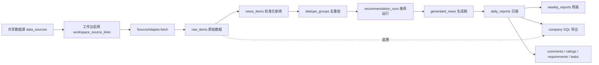
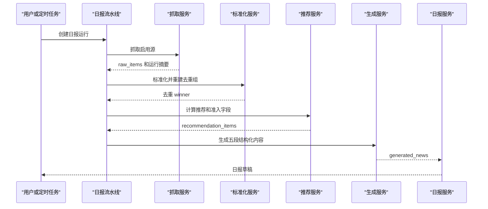
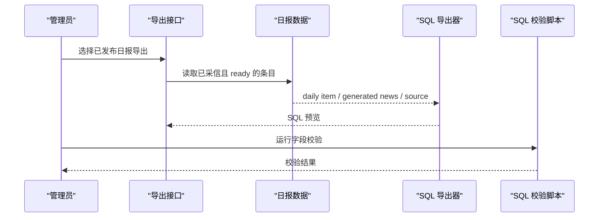

# AI情报官软件设计说明书

## 1. 文档目的

本文是 AI情报官的 SDD（Software Design Description）总装版，用于说明系统目标、设计约束、模块划分、数据流、接口边界、DFX 要求和后续扩展方式。详细字段以 `config/contracts/*.json` 为准，专题细节以对应设计文档为准。

完整文档权威关系见 [文档地图与治理规则](../README.md)。常用入口：

- [系统总纲](../00-system-design.md)
- [架构设计分层](design-governance.md)
- [前端产品与页面设计](../product/frontend-product-design.md)
- [前端逐页规格与完成标记](../product/page-specs/frontend-page-specs.md)
- [后端功能模块设计](../backend/backend-module-design.md)
- [契约与测试治理](../backend/contract-test-governance-design.md)
- [API 与 UI 实现对照](../implementation/api-and-ui-implementation.md)
- [采集、适配器与去重设计](../backend/ingestion-adapter-dedup-spec.md)
- [数据格式与 SQL 映射](../backend/data-format-mapping.md)
- [数据追溯与存储](../backend/data-lineage-and-storage.md)
- [扩展点设计](../backend/extension-points.md)
- [统一登录设计](../deployment/auth-unified-login.md)
- [部署运维设计](../deployment/deployment-ops.md)

## 2. 系统范围

AI情报官用于持续接入公开信源和内部补充资料，把原始信息保存为可追溯数据，再形成候选新闻、推荐结果、日报、周报和公司 SQL 导出。

第一阶段范围：

- 信源管理：共享源池、工作台启用关系、源类型、源质量和源状态。
- 抓取入库：RSS、paper RSS、页面源、补采入口和抓取运行记录。
- 数据加工：raw 原始数据、news 标准化、canonical URL、去重组和 winner。
- 推荐和采信：候选池、推荐运行、结构化准入评分、日报采信和周报采信。
- 报告生产：日报草稿、生成稿、编辑覆盖、发布状态、周报候选管理。
- 公司 SQL：按旧系统合同导出 `ai_journal`、`ai_journal_focus`、`ai_journal_analysis`、`t_news_data_info`。
- 运维支撑：定时任务、补采覆盖率、审计、需求、任务和多环境同步预留。

不在第一阶段范围：

- 不把系统写死成单一 RSS 日报工具。
- 不把历史参考库作为运行入口。
- 不自动把旧系统历史素材写入当前推荐和公司 SQL。
- 不把数据源方向标签写入成品新闻一级分类。

## 3. 设计原则

1. 原始数据优先保留。抓取结果先进入 `raw_items.raw_payload_json`；同源同 entry_key 重抓按最新抓取幂等刷新（upsert 语义），标准化/去重/推荐/编辑等下游加工永不回写原始记录。
2. 字段合同先于实现。公司 SQL、成品新闻五段结构、分类和同步边界由 `config/contracts` 固化。
3. 去重在推荐之前。`raw_items` 标准化为 `news_items` 后再进入 `dedupe_groups`。
4. 采信属于报告层。`adoption_status` 只属于日报/周报条目，不属于原始新闻。
5. 编辑不污染生成稿。日报编辑只写报告层覆盖字段，不改 `raw_items` 和 `generated_news`。
6. 扩展不破坏主链路。新增 adapter、评分策略、导出方式、登录方式和领域包优先通过扩展点接入。
7. 公网和内网边界明确。公开信号可以同步到内网，内网反馈默认不回流公网。

## 4. 总体架构



系统采用单仓 monorepo：

```text
backend/   FastAPI 服务、数据库模型、迁移、抓取、推荐、报告、导出和测试
frontend/  Vue 3 工作台页面
config/    字段合同、分类、种子源、评分配置和环境样例
docs/      设计、开发、部署、数据映射和运维文档
scripts/   SQL 校验、历史导入、数据回填等工具
```

## 5. 主要模块设计

### 5.1 数据源与抓取

数据源分为共享源池和工作台启用关系。共享源保存源本身的信息，工作台链接保存启用状态、权重、日限和工作台策略。

抓取模块负责：

- 按工作台启用源创建 `ingestion_runs`。
- 调用对应 `SourceAdapter` 获取条目。
- 记录成功源、失败源、抓取数、创建数、更新数和失败原因。
- 支持常规抓取和历史补采。

当前 12 类 `source_type` 全部有真适配器（`config/contracts/source_fields.json`），
其中 `wechat` 是自研微信公众号 adapter：rsshub 主路径（feed_url/rsshub_route/账号
标识推导）+ `article_urls` 定点抓取，wx 桥 sidecar 只是可选增强。adapter 凭据只允许
`credential_ref` 引用（`env:VAR` / `file:/path`，`backend/app/core/credentials.py`），
非法或缺失降级匿名抓取并记 WARNING。部署级采集类型允许清单由
`INGESTION_SOURCE_TYPES` 控制（不在清单的源计入 run 摘要 `skipped_type_disabled`）。

关键文件：

- `backend/app/adapters/base.py`
- `backend/app/adapters/rss.py`
- `backend/app/adapters/wechat.py`
- `backend/app/core/credentials.py`
- `backend/app/ingestion/runs.py`
- `backend/app/api/routes/ingestion.py`

### 5.2 标准化与去重

标准化模块把原始数据转换为 `news_items`，补齐标题、摘要、来源、发布时间、canonical URL 和 dedupe key。去重模块按工作台隔离建立 `dedupe_groups`，同组只保留一个 active winner 进入推荐。

设计约束：

- 原始 HTML 或完整 payload 保留在 raw 层。
- 标准化失败不能删除 raw。
- 去重失败不能影响其他工作台。

关键文件：

- `backend/app/normalization/news.py`
- `backend/app/api/routes/news.py`
- `backend/app/models/content.py`

### 5.3 推荐与内容准入

推荐模块只处理去重 winner。评分由基础分、源质量、内容关键词、主题权重、噪声规则和专家路由组成。推荐结果写入 `recommendation_items`，同时保存结构化字段，便于前端解释和后续复盘。

关键输出：

- `admission_level`
- `admission_score`
- `admission_pool`
- `noise_types`
- `reject_reasons`
- `scorer_breakdown`
- `expert_routes`

关键文件：

- `backend/app/recommendations/service.py`
- `backend/app/scoring/content_scorer.py`
- `config/scoring/content_scorer_v2.json`

### 5.4 日报与周报

日报从推荐项生成草稿。生成稿 ready 后才允许进入标准 SQL。管理员可在日报层采信、剔除、编辑、评论和评分。

发布策略是工作台配置：`workspaces.config_json.report_policy.auto_publish_daily`
（默认 true，`GET/PATCH /api/workspaces/{code}/report-policy`）决定流水线出稿后是否
自动发布（actor=system，审计 `daily_report.auto_publish`）；已发布日报的报告层字段
允许 admin+ 修订，写 `post_publish_revision` 审计并重投影 renditions，raw、
`generated_news` 和公司 SQL 契约不受影响（`docs/backend/reports-editorial-design.md`
§7.1/§7.2）。阅读侧 `workspace_sections` 的阅读分区 min_role=viewer，viewer 只读
发布时投影的 rendition 快照，编审操作整组隐藏
（`docs/product/frontend-product-design.md` §5.3）。

周报第一版不自动生成长文，只管理采信项版本。周报草稿从已发布日报中 `adoption_status = 2` 的条目生成，按成品新闻一级标签形成板块。

2026-07-07 定稿、2026-07-08 已实现的两项增量（本节只收敛口径，实现级规格见对应事实源）：

- **分层调度**：每日流水线的触发时刻、day_offset、run 级失败自动重试
  （backoff、重试链 `retry_of_run_id` 可追溯、`partial` 永不触发）和周报草稿节拍
  由「实例 env 基线 + 工作台 `workspaces.config_json.schedule_policy`」两层决定，
  scheduler 每 60s tick 读 DB per-workspace 触发并写 `scheduler_heartbeats` 心跳；
  调度状态经 `GET /api/pipeline/scheduler/status` 在界面自证。工作台策略不能越过
  实例总闸与 `DEPLOY_MODE` 能力开关；全部工作台无策略时行为与现状一致。
  事实源：`docs/backend/pipeline-jobs-design.md` §6/§8；契约：
  `config/contracts/workspace_model.json` `schedule_policy`。
- **模板驱动生成链**：自定义报告格式可携带 JSON/XML 声明式模板
  （`report_formats.generation_template`，XML 安全解析后统一存规范形），判定规则
  「投影优先、仅基稿没有的字段追加生成」；增量字段只写
  `generated_news.template_extras_json[format_code]`，永不进入
  `content_json`/`insight_json`/`category`/去重/推荐/公司 SQL，任何降级都不阻塞
  `company_sql_v1` 链路与采信。生成 provider 分层配置（key 只在实例 env、工作台
  `generation_policy` 管模型参数与预算、`POST /api/generation/ping` 连通性自检）
  见 `docs/backend/generation-provider-design.md`。模板事实源：
  `docs/backend/reports-editorial-design.md` §8.1、
  `docs/backend/report-renditions-design.md` §10；契约：
  `config/contracts/report_renditions.json` `generation_template`。

关键文件：

- `backend/app/pipeline/daily.py`
- `backend/app/api/routes/reports.py`
- `backend/app/reports/weekly.py`
- `frontend/src/pages/DailyReportsPage.vue`
- `frontend/src/pages/WeeklyReportsPage.vue`

### 5.5 公司 SQL 导出

公司 SQL 导出保持旧内网字段合同。导出范围为已发布日报中已采信、生成稿 ready 且非规则兜底的条目。

导出约束：

- `content_json` 只保留五段旧字段。
- `created_at` 使用 `'YYYY-MM-DD HH:MM:SS'` 字面量。
- 来源缺失发布时间时，默认使用日报日期早上 09:00。
- 导出前必须通过 `scripts/validate_company_sql.py` 校验。

关键文件：

- `backend/app/exports/company_sql.py`
- `GET /api/exports/{export_job_id}/trace`
- `config/contracts/news_sql_mapping.json`
- `docs/backend/data-format-mapping.md`

导出追溯：

- `export_jobs` 保存导出批次和 SQL 预览结果。
- `export_job_items` 按 SQL 语句保存 `daily_report_item_id`、`generated_news_id`、`news_item_id`。
- trace API 通过 `news_items -> raw_items -> data_sources` 补齐原始来源链路。
- 追溯字段只留在 InfoWatchtower 自己的关系表和 API 中，不写入公司 SQL 的 `content_json`。

### 5.6 部署形态与能力开关

同一套代码支撑四种部署形态，由单一环境变量 `DEPLOY_MODE` 一等抽象定义
（契约：`config/contracts/deployment_modes.json`；实现级规格：
`docs/deployment/deployment-topology.md`）：

```text
standalone   本地一键 Docker，自采自用（CSRF 默认关）
cloud        云主机官方站：管理员采集，非管理员 viewer 只读
intranet     内网门户同站反代 iframe 嵌入：禁采集、pull-only 消费者、header 登录
extranet     公网发布者：OIDC SSO，开放 GET /api/sync/feed 向内网下发
```

`DEPLOY_MODE` 派生能力开关（`ingestion/sync_publisher/sync_consumer/embedding/search`），
三层同时 gate：API 按开关 403（`require_capability`）、scheduler 按开关投任务、前端
按免登录的 `GET /api/meta/runtime` 隐藏入口。非法组合（AUTH_MODE 不在形态白名单、
intranet 覆盖打开采集、extranet 缺 `SYNC_SERVICE_TOKENS`、缺 `AUTH_SESSION_SECRET`、
`AUTH_GUEST_ENABLED` 配到 standalone/cloud 之外等）由
`backend/app/core/deploy_checks.py` 在 API/scheduler/worker 三个进程入口
统一 fail-fast。

安装层提供三种启动预设（`deploy/install.sh --preset rss-only|full|mirror`，默认
full；契约：`config/contracts/deployment_modes.json` `install_presets`）：`rss-only`
写 `INGESTION_SOURCE_TYPES=rss,paper_rss` 做部署级采集类型允许清单；`mirror` 写
`CAPABILITY_INGESTION=false` + sync consumer pull，本地不采集、只从外部部署拉取
成果；`full` 不写允许清单。预设只生成 env 组合，不引入新的代码分支。

关键文件：

- `backend/app/core/config.py`（MODE_CAPABILITIES/MODE_CSRF_DEFAULTS/MODE_ALLOWED_AUTH_MODES）
- `backend/app/core/deploy_checks.py`、`backend/app/core/security.py`
- `backend/tests/test_deployment_modes.py`
- `docs/backend/backend-capability-test-matrix.md`（形态 × 能力 × 必跑测试矩阵）

### 5.7 登录、权限和同步

系统支持公网账号密码登录、通用 OIDC authorization code flow + PKCE（含 id_token
验签/强校验）和公司内网可信 header 登录（可选 `AUTH_TRUSTED_PROXY_CIDRS` 信任边界
兜底）。内网同步遵循单向硬不变式：外网公开信号向内网同步，内网用户反馈永不回流公网。

权限与协作边界的三个补充设计（2026-07 已实现）：

- **游客只读浏览**：`AUTH_GUEST_ENABLED` 是叠加在 `AUTH_MODE` 之上的开关（仅
  standalone/cloud 允许，启动自检 fail-fast）。游客共享一个只读本地账号
  （`external_provider=guest`），不持有 workspace membership，按隐式 viewer 视角
  浏览 `internal_public` 工作台；一切非安全方法在 `get_current_user` 单点 403
  （仅放行 logout）。契约：`config/contracts/auth_modes.json` `guest_access`。
- **工作台可见性与自助订阅**：`workspaces.visibility`（`private | internal_public`）
  + `GET /api/workspaces/discover` + `POST/DELETE /api/workspaces/{code}/subscribe`
  让登录用户自助订阅公开工作台为 viewer 成员（幂等、不降级已有角色）；private
  工作台对非成员不泄露存在。契约：`config/contracts/workspace_model.json`
  `discovery_and_subscription`。
- **工作台加入码与公开形态矩阵（2026-07-07 定稿，2026-07-08 已实现）**：公开的上限是
  「`internal_public` + 游客只读」，不提供匿名公开写入；`private` 工作台的团队
  自助入口是工作台加入码（`workspace_join_codes`：每工作台至多一个 active 码、
  只授 viewer/member、可轮换/停用/限期限次；`join-by-code` 幂等不降级、统一失效
  400 防枚举、按用户+IP 限流），与面向未注册个人的全局邀请码互补；发现搜索
  `discover?q=` 只覆盖 `internal_public`。事实源：
  `docs/backend/workspace-configuration-design.md` §14；契约：
  `config/contracts/workspace_model.json` `join_code`、
  `config/contracts/auth_modes.json` `identity_audit_actions`。
- **用户组与批量入台**：`user_groups`/`user_group_members` 是运营分组而非第三层
  权限；super_admin/editor_admin 管组，workspace admin 通过
  `POST /api/workspaces/{code}/members/bulk` 按组幂等批量入台（不升降级已有角色、
  owner 仍走单人危险确认流程）。任务指派（`topic_tasks.assignee_user_id`）要求被
  指派人是同工作台成员并触发 `task.assigned` 站内通知
  （`config/contracts/strategic_loop.json` `task_assignment_v1`）。

每个工作台的运营配置收敛到工作台配置中心（前端 `/workspace-settings`，
`workspace_sections` 注册的 system 分区，min_role=admin）：基本信息、导航分区启停
（`GET /api/workspaces/{code}/sections/manage` + `PATCH .../sections/{key}`）、标签
策略、报告策略（自动发布）、成员管理和报告格式注册表；viewer 反馈策略仍在 `/users`
策略视图编辑。

机器同步主路径是 extranet feed 下发 / intranet 定时拉取（已实现，
`backend/app/sync/`）：

- `GET /api/sync/feed(/manifest)`：业务表水位直查、keyset 游标、无副作用可重放，
  service token 鉴权（支持命名消费者），访问写审计。
- `POST /api/sync/pull-runs` + scheduler 定时任务：intranet 按序拉取
  `data_sources → raw_items → news_items → generated_news → daily_reports →
  weekly_reports` 六类对象，经 `app/sync/apply.py` 的 apply handler 幂等落库，
  revision/content_hash 冲突写 `sync_conflicts` 并有查询/resolve 闭环，
  `sync_cursors` 记录水位，`GET /api/sync/health` 汇总健康告警。
- 手工同步包（export/download/import）保留为网络隔离场景的人工 fallback 通道。

关键文件：

- `backend/app/auth/service.py`、`backend/app/auth/oidc.py`
- `backend/app/sync/`（feed.py/pull.py/apply.py/retry.py）
- `docs/deployment/auth-unified-login.md`
- `docs/deployment/auth-security-roadmap.md`
- `docs/deployment/multi-environment-sync.md`

## 6. 关键时序

### 6.1 日报生成



### 6.2 公司 SQL 导出



## 7. DFX 设计

| 类型 | 设计要求 | 落地方式 |
| --- | --- | --- |
| 功能性 | 覆盖信源接入、抓取、标准化、去重、推荐、日报、周报、SQL 导出和历史归档 | 后端路由、前端页面、数据库模型和配置合同共同约束 |
| 性能 | 多源抓取不能被慢源串行阻塞 | 支持抓取并发数和单源超时配置 |
| 可靠性 | 任何加工结果都能追溯到原始数据 | raw payload 完整保存，报告编辑只写报告层 |
| 可用性 | 生成服务失败不能阻塞日报流程 | MiniMax 超时或失败时生成 fallback 草稿并标记需复核 |
| 安全性 | 密钥、cookie、token 不入库、不入 Git | `.env` 忽略、配置样例脱敏、登录能力独立设计 |
| 可维护性 | 字段和流程不靠口头约定 | `config/contracts`、文档地图和校验脚本同步维护 |
| 可扩展性 | 新来源、新板块、新导出不改主链路 | Adapter、domain pack、exporter、auth adapter 扩展点 |
| 可测试性 | 核心链路能本地和 CI 重复验证 | pytest、前端 build、SQL 校验和覆盖率门禁 |

## 8. 设计模式和 SOLID 对应

- 单一职责：adapter 只抓取，normalization 只标准化，recommendation 只评分和选候选，exporter 只导出 SQL。
- 开闭原则：新增来源、评分规则、领域包和导出方式优先新增模块或配置。
- 依赖倒置：抓取主流程依赖 `SourceAdapter` 抽象，不依赖具体 RSS 或页面实现。
- 策略模式：推荐准入和噪声规则由配置驱动。
- 构建器思路：周报从已发布日报采信项构建候选，不直接修改日报条目。
- 边界隔离：历史资产归档、当前推荐和公司 SQL 导出三条路径分离。

## 9. 测试设计

后端测试覆盖：

- 登录和权限。
- 数据源 API。
- 抓取和补采。
- raw 标准化和去重。
- 推荐运行和内容准入。
- 日报流水线。
- 周报草稿和条目编辑。
- 公司 SQL 导出。
- SQL 导出 trace API。
- 部署形态与能力开关（四形态启动自检、能力门、runtime meta）。
- sync feed/pull、apply handler、冲突处置和 failed inbox 重试。
- Tech Insight Loop 源治理和历史归档导入。

测试计数与覆盖率以 CI 实跑结果为准（`.github/workflows/ci.yml` 的
backend-coverage-report artifact），本文不再硬编码通过数量；四种部署形态
对应的必跑测试文件矩阵见 `docs/backend/backend-capability-test-matrix.md`。

CI 门禁：

- 后端测试必须通过（含覆盖率报告产物）。
- 前端 Vitest 必须通过，随后前端构建必须通过。
- CI 生成 `coverage.xml` 和 `htmlcov`，并上传 `backend-coverage-report` artifact。
- CI 运行 `scripts/check_prod_deploy.py --env-file deploy/env.production.example` 检查生产部署配置。
- 本地等价入口是 `make test`（docs/契约治理校验 + 后端 pytest + 前端 vitest + 前端 build）。

## 10. 后续演进项

| 项目 | 说明 |
| --- | --- |
| 深度历史补采 | arXiv/OpenAlex/Semantic Scholar paper_api v1 已补；仍需要超出 RSS 当前窗口的归档页、sitemap、OpenReview 等更多论文 provider |
| 周报正文生成 | 当前只管理采信项和规则摘要投影，自动长文生成仍是后续任务 |
| 实机验收证据 | 真实 OIDC provider、双实例网络同步演练、prod TLS 证书签发、门户真实 iframe 联调、离线升级演练、生产备份恢复演练（见 `SESSION-HANDOFF.md` E 系清单） |
| wx 公众号采集增强 | `wechat` adapter 已自研落地（rsshub 主路径 + article_urls 定点抓取，不依赖 wx 二进制）；剩余为可选增强：wx 桥接 sidecar 参考实现与自建 RSSHub/桥的实机抓取验收 |
