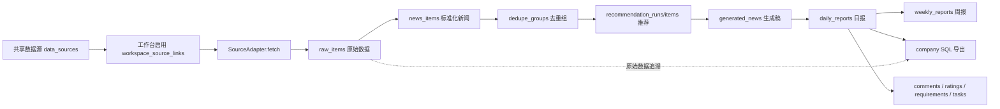
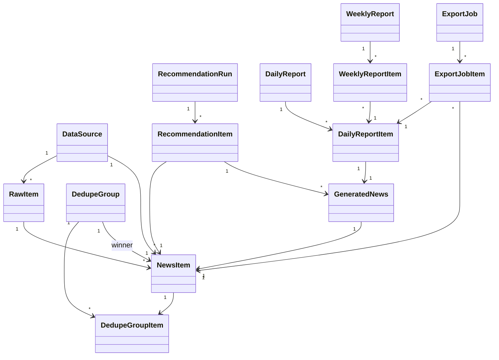
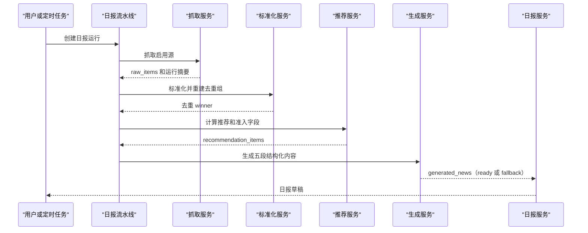
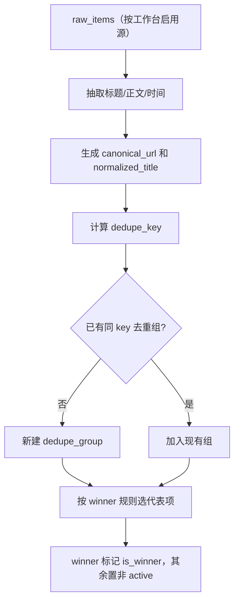
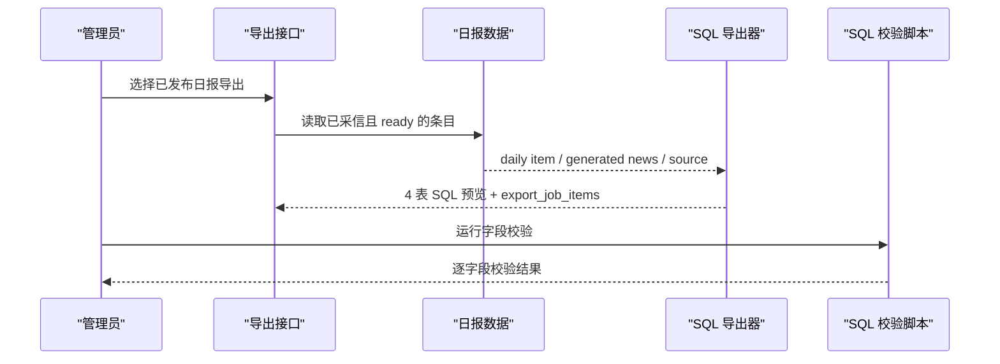

# AI情报官软件设计说明书（SDD）

## 1. 文档目的与范围

本文是 AI情报官的软件设计说明书（Software Design Description）总装版，是设计提纲和各专题详细内容的合集，作为系统的全量设计文档。`docs/00-system-design.md` 是更短的总纲/提纲，本文在其基础上展开架构、数据、模块、接口、流程、DFX、设计模式和扩展方式的详细设计。

字段级细节以 `config/contracts/*.json` 为准。本文与契约冲突时，先同步修正再实现。专题文档（采集去重、SQL 映射、数据追溯、登录、部署、同步、扩展点等）作为本文的补充细节来源，已在对应章节折入要点。

## 2. 设计方法

系统不是从旧系统直接迁移，而是保留旧系统已验证的字段和 SQL 合同，重新搭一套可维护、可测试、可扩展的实现。设计上用四类材料控制边界：

1. 总纲（`docs/00-system-design.md`）定义系统定位、主数据流和阶段范围。
2. 本 SDD 把架构、模块、接口、数据、流程、DFX 和扩展方式装配成全量设计文档。
3. 开发提纲（`docs/01-implementation-plan.md`）把设计拆成可验收的阶段。
4. 机器契约（`config/contracts/*.json`）固定字段、SQL 映射、工作台、同步策略和扩展点。

四条具体方法：

- **合同先行**：先固定旧系统和内网 SQL 字段，再实现主链路，避免字段漂移。SQL 字段由 `config/contracts/news_sql_mapping.json` 描述，由 `scripts/validate_company_sql.py` 逐字段校验。
- **原始数据先落库**：抓取结果先完整写入 `raw_items`，再做标准化、去重、推荐和报告，任何加工都能追回原始记录。
- **分层存储**：原始数据、标准化新闻、去重结果、推荐结果、生成稿和报告分表存放，互不覆盖。
- **文档与代码同步**：改字段同步契约和数据样例，改 SQL 同步映射和校验脚本，改登录或同步同步对应设计文档，规则写在 `AGENTS.md`。

## 3. 系统范围与边界

AI情报官持续接入公开信源和内部补充资料，把原始信息存为可追溯数据，再形成候选新闻、推荐结果、日报、周报和公司 SQL 导出。

第一阶段范围：

| 能力 | 内容 |
| --- | --- |
| 信源管理 | 共享源池、工作台启用关系、源类型、源质量、源状态 |
| 抓取入库 | RSS、paper RSS、页面源、历史补采、抓取运行记录 |
| 数据加工 | raw 原始数据、news 标准化、canonical URL、去重组和 winner |
| 推荐采信 | 候选池、推荐运行、结构化准入评分、日报采信、周报采信 |
| 报告生产 | 日报草稿、生成稿、编辑覆盖、发布、周报候选管理 |
| 公司 SQL | 按旧系统合同导出 `ai_journal`、`ai_journal_focus`、`ai_journal_analysis`、`t_news_data_info` |
| 运维支撑 | 定时任务、补采覆盖率、审计、需求、任务、多环境同步骨架 |

边界（明确不做的事）：

- 不把系统写死成单一 RSS 日报工具。
- 不把历史参考库当作运行入口。
- 不把旧系统历史素材自动写入当前推荐和公司 SQL。
- 不把数据源方向标签写入成品新闻一级分类。

## 4. 设计原则

1. 原始数据优先保留：抓取结果先进 `raw_items.raw_payload_json`，后续加工不覆盖。
2. 字段合同先于实现：公司 SQL、成品新闻五段结构、分类和同步边界由 `config/contracts` 固化。
3. 去重在推荐之前：`raw_items` 标准化为 `news_items` 后再进 `dedupe_groups`，推荐只看 winner。
4. 采信属于报告层：`adoption_status` 只属于日报/周报条目，不属于原始新闻。
5. 编辑不污染生成稿：日报编辑只写报告层覆盖字段，不改 `raw_items` 和 `generated_news`。
6. 扩展不破坏主链路：新增 adapter、评分策略、导出方式、登录方式和领域包走扩展点。
7. 公网内网边界清晰：公开信号可同步到内网，内网反馈默认不回流公网。

## 5. 总体架构

### 5.1 技术选型

| 层 | 选型 |
| --- | --- |
| 后端 | Python 3.12、FastAPI、SQLAlchemy 2.0、Alembic |
| 数据库 | PostgreSQL（JSON 字段用 JSONB），本地测试用 SQLite 内存/临时库建表运行 |
| 后台任务 | Redis + RQ worker，APScheduler 风格定时入口 |
| 前端 | Vue 3、TypeScript、Vite、Pinia |
| 部署 | 单仓 monorepo、Docker Compose、Caddy 反向代理 |

### 5.2 仓库分层

```text
backend/   FastAPI 服务、数据库模型、迁移、抓取、标准化、推荐、报告、导出、测试
frontend/  Vue 3 工作台页面
config/    字段合同、分类、种子源、评分配置、环境样例
docs/      设计、开发、部署、数据映射、运维文档
scripts/   SQL 校验、历史导入、数据回填等工具
deploy/    生产 compose、反向代理、生产 env 模板
```

后端内部按职责分包：`adapters` 抓取、`normalization` 标准化、`dedupe` 去重、`scoring` 内容评分、`recommendations` 推荐选择、`reports`/`pipeline` 报告、`exports` 导出、`auth` 登录权限、`ingestion` 抓取运行、`workers` 后台任务、`models` 数据模型、`schemas` 接口契约、`api/routes` 接口层。

### 5.3 主链路架构图



### 5.4 运行拓扑

```text
reverse_proxy (Caddy)
  -> frontend 静态文件
  -> backend FastAPI
backend + worker + scheduler 共用一套代码
postgres   业务数据
redis      任务队列
```

公网和内网用同一套代码，差异通过 `.env`、`AUTH_MODE`、域名、密钥和同步开关控制，不分叉代码仓。

## 6. 数据设计

### 6.1 横切字段

主要业务表通过 mixin 复用横切字段（`backend/app/models/common.py`）：

| Mixin | 字段 | 作用 |
| --- | --- | --- |
| IdMixin | `id` | UUID 字符串主键 |
| TimestampMixin | `created_at`、`updated_at` | 时间戳，更新时自动刷新 |
| ScopeMixin | `workspace_code`、`domain_code`、`visibility_scope`、`sync_policy` | 工作台、板块、可见范围、同步策略 |
| SyncMixin | `global_id`、`origin_instance_id`、`revision`、`content_hash` | 跨环境同步稳定标识和冲突处理 |

`workspace_code`、`domain_code`、`visibility_scope`、`sync_policy` 贯穿数据源、raw、news、推荐和同步链路，是后续多板块和多环境扩展的基础。

### 6.2 核心实体

数据库共 46 张表：44 张业务表外加 `user_roles`、`role_permissions` 两张 RBAC 多对多关联表（Alembic 迁移共 46 个 `create_table`），覆盖用户权限、工作台、共享源、标签、raw/news、去重、推荐、日报周报、互动反馈、SQL 导出、同步回流和战略闭环。主链路核心表：

| 表 | 关键字段 | 说明 |
| --- | --- | --- |
| `data_sources` | `source_type`、`url`、`source_score`、`metadata_json` | 全局共享源 |
| `workspace_source_links` | `workspace_id`、`data_source_id`、`source_weight`、`daily_limit` | 工作台启用某源及其权重日限 |
| `raw_items` | `entry_key`、`raw_payload_json`、`fetched_at`、`published_at` | 原始抓取数据，按 `data_source_id + entry_key` 唯一 |
| `news_items` | `canonical_url`、`dedupe_key`、`normalization_status`、`active` | 标准化新闻 |
| `dedupe_groups` / `dedupe_group_items` | `dedupe_key`、`winner_news_item_id`、`is_winner` | 去重组，按 `workspace_code + dedupe_key` 唯一 |
| `recommendation_runs` / `recommendation_items` | 七维分数、`admission_level`、`noise_types_json`、`scorer_breakdown_json` | 推荐运行与可解释打分 |
| `generated_news` | `category`、`content_json`、`generated_by`、`generation_status` | 五段结构化生成稿 |
| `daily_reports` / `daily_report_items` | `day_key`、`status`、`adoption_status`、`editor_*` | 日报与采信项，按 `workspace+domain+day_key` 唯一 |
| `weekly_reports` / `weekly_report_items` | `week_key`、`adoption_status` | 周报与采信项 |
| `export_jobs` / `export_job_items` | `sql_table`、`sql_sequence`、`sql_text` | SQL 导出批次和逐语句追溯 |
| `users` / `roles` / `permissions` | RBAC 多对多 | 登录与权限 |

### 6.3 关键约束与追溯链

- 唯一约束防重复：`raw_items(data_source_id, entry_key)`、`dedupe_groups(workspace_code, dedupe_key)`、`daily_reports(workspace_code, domain_code, day_key)`。
- 外键保证追溯：每条日报条目可沿 `daily_report_items -> generated_news -> recommendation_items -> dedupe_group_items -> news_items -> raw_items -> data_sources` 回到原始信号。
- 导出追溯独立成表：`export_job_items` 保存每条 SQL 语句对应的 `daily_report_item_id`、`generated_news_id`、`news_item_id`，trace 接口据此补齐 raw 和数据源。

### 6.4 核心类图



## 7. 模块详细设计

### 7.1 数据源与抓取

共享源保存源本身信息，工作台链接保存启用、权重、日限和策略。抓取模块按工作台启用源创建 `ingestion_runs`，调用对应 `SourceAdapter` 取条目，记录成功源、失败源、抓取数、新增数、更新数和失败原因，支持常规抓取和历史补采。抓取支持并发池和单源超时（默认并发 8、单源 25 秒），结果仍按源顺序串行入库，按 `data_source_id + entry_key` 幂等写入。

源类型预留 `wiseflow/rss/paper_rss/page_monitor/page_manual/crawler/paper_api/paper_page/manual/internal`，第一版实现 RSS、paper RSS 和页面源；其余以 adapter 骨架预留。

关键文件：`backend/app/adapters/base.py`、`backend/app/adapters/rss.py`、`backend/app/ingestion/runs.py`、`backend/app/api/routes/ingestion.py`。

### 7.2 标准化与去重

标准化把原始数据转成 `news_items`，补齐标题、摘要、来源、发布时间、canonical URL、normalized title 和 dedupe key。去重按工作台隔离建立 `dedupe_groups`，同组只保留一个 active winner 进推荐。原始 HTML 和完整 payload 保留在 raw 层；标准化或去重失败不删除 raw，也不影响其他工作台。

canonical URL 规则：scheme 和 host 转小写；去 fragment；path 去末尾 `/`；去掉 `utm_*`、`spm`、`ref`、`ref_src`、`fbclid`、`gclid` 等追踪参数。

dedupe key 规则（保守硬去重）：

- 有 URL：`dedupe_key = "url:" + canonical_url`。
- 无 URL：`dedupe_key = "title:" + normalized_title + "|date:" + yyyy-mm-dd`。

winner 选择顺序：有 URL → wiseflow legacy 加成 → 官方/可信源 → 正文更完整 → 发布时间更新。

关键文件：`backend/app/normalization/news.py`、`backend/app/api/routes/news.py`、`backend/app/models/content.py`。

### 7.3 推荐与内容准入

推荐只处理去重 winner，按 `day_key` 选目标日候选。先做内容准入分级，再按等级和配额选日报候选。

打分维度（持久化在 `recommendation_items`，可解释）：

```text
quality_score   topic_score   freshness_score   feedback_score
diversity_score source_score  heat_score        final_score
admission_level admission_score admission_pool
noise_types     reject_reasons  scorer_breakdown  expert_routes
```

综合分加权（`recommendations/service.py`）：

```text
final = admission*0.35 + quality*0.15 + topic*0.20
      + freshness*0.10 + source*0.10 + heat*0.10
      + feedback*0.05 + diversity
```

内容准入分级 P0/P1/P2/P3/R：P0/P1 为强相关技术信号优先进日报，P2 为中价值补位，P3 默认只检索可见，R 为噪声不进日报。`R` 综合分封顶 25、`P3` 封顶 44。准入由基础规则给出，再叠加 `config/scoring/content_scorer_v2.json` 驱动的二级评分器（源等级、渠道、板块相关度、专家路由、噪声惩罚）。

日报选择约束：总条数 `limit`（默认 15）、单源日限 `source_daily_limit`（默认 2）、论文源占比约 10%、单一内容池占比约 40%，避免被某类来源刷屏。`planning_intel` 默认技术情报优先，降权融资财报、消费硬件、纯营销和离题内容。

关键文件：`backend/app/recommendations/service.py`、`backend/app/scoring/content_scorer.py`、`config/scoring/content_scorer_v2.json`。

### 7.4 生成与日报周报

选中候选调用 MiniMax（中国区 OpenAI-compatible `chat/completions`）生成五段结构化稿 `background/effects/eventSummary/technologyAndInnovation/valueAndImpact`，状态置 `ready`；未启用、超时或失败时落 `rule_v1:fallback` 草稿并标记 `fallback_needs_review`，不阻塞整天日报，也不能进标准 SQL。

日报从生成稿建草稿，管理员可采信、剔除、编辑标题/摘要/要点/五段正文，并发布。编辑只写报告层 `editor_*` 覆盖字段，不改 `raw_items` 和 `generated_news`。周报第一版不自动写长文，只管理采信项：从已发布日报中 `adoption_status = 2` 的条目生成候选，按成品新闻一级标签分板块，支持板块内采信、排序、编辑和发布。

关键文件：`backend/app/pipeline/daily.py`、`backend/app/llm/minimax.py`、`backend/app/api/routes/reports.py`、`backend/app/reports/weekly.py`、`frontend/src/pages/DailyReportsPage.vue`、`frontend/src/pages/WeeklyReportsPage.vue`。

### 7.5 公司 SQL 导出

导出保持旧内网字段合同，范围是已发布日报中 `adoption_status = 2`、`generated_news.generation_status = ready` 且 `generated_by` 非 `rule_v1` 的条目。每条新闻固定生成 4 条 SQL，顺序不可变：

| 顺序 | 表 | 列 |
| --- | --- | --- |
| 1 | `ai_journal` | `source_url, source_title, content, created_at` |
| 2 | `ai_journal_focus` | `journal_id, focus_id` |
| 3 | `ai_journal_analysis` | `journal_id, category, title, summary, key_points, content_json, source_url, created_at` |
| 4 | `t_news_data_info` | `catalog_id, journal_id, data, adoption_status, category, title, summary, key_points, content_json, source_url` |

字段规则：后三表用 `INSERT ... SELECT id FROM ai_journal WHERE source_url = ... LIMIT 1` 串联；`content_json` 只保留五段旧字段，不含追溯字段；`category` 用 `generated_news.category`，必须属于规划部 AI 十分类；`created_at` 用北京时间 `'YYYY-MM-DD HH:MM:SS'` 字面量，缺发布时间时兜底为日报日期 09:00，禁止 `NULL/STR_TO_DATE/CAST`；`ai_journal.source_title/content` 导出前清洗为纯文本，原始 HTML 保留在 `raw_items`。导出前必须通过 `scripts/validate_company_sql.py`，脚本以 `2026-05-05` 预览为基准逐字段校验表顺序、列名、URL 串联、日期、五段 JSON 和 HTML 污染。

导出追溯：`export_jobs` 存批次和预览，`export_job_items` 按 SQL 语句存映射，`GET /api/exports/{id}/trace` 通过 `news_items -> raw_items -> data_sources` 补齐来源链路。

关键文件：`backend/app/exports/company_sql.py`、`backend/app/api/routes/exports.py`、`config/contracts/news_sql_mapping.json`、`scripts/validate_company_sql.py`。

### 7.6 互动反馈与热度

日报条目支持点赞、评分和评论（`reactions/ratings/comments`）。热度回流推荐打分：`heat_score = likes*8 + comments*12 + 评分条数 * 平均分 * 3`（封顶 100），`feedback_score` 取平均评分映射。用户反馈和管理员采信后续继续反哺 `heat_score/feedback_score/source_score`。

关键文件：`backend/app/models/feedback.py`、`backend/app/api/routes/reports.py`、`docs/feedback-heat-scoring.md`。

### 7.7 登录与权限

公网和内网共用一套本地用户、角色、权限和审计模型。外部认证只证明身份，RBAC 决定权限。第一版认证模式 `local/public_password/intranet_header`，统一流程：

```text
AuthAdapter -> ExternalIdentity -> IdentityResolver -> users -> session -> RBAC
```

`intranet_header` 只能部署在可信网关后面，后端不能被绕过网关直接访问。接口用依赖项 `get_current_user`（要求登录）和 `require_super_admin`（要求超级管理员）鉴权，写操作和导出调用 `write_audit` 写审计日志。预留 Google OIDC 和公司 IDaaS code flow adapter。

关键文件：`backend/app/auth/service.py`、`backend/app/api/routes/auth.py`、`config/contracts/auth_modes.json`、`docs/auth-unified-login.md`、`docs/auth-security-roadmap.md`。

### 7.8 公网内网同步

长期为两库：public DB 做公开采集和 raw/news/recommendation，intranet DB 做内部用户、评论、采信、需求、任务和公司 SQL。采用应用层 outbox/inbox 同步，不做双写。同步前检查 `visibility_scope` 和 `sync_policy`；公开信号向内网单向同步，内网反馈默认不回流；密钥只用 `credential_ref` 引用，不进同步包和 Git。

第一版提供可审计同步包链路：`POST /api/sync/packages/export` 从 `sync_outbox` 生成 manifest 和 records，`download` 下载 zip（含 `manifest.json` 和 `records.jsonl`），`import` 写 `sync_inbox` 做幂等和审计，并对 `data_sources/raw_items/news_items` 按 `object_global_id/global_id` 执行业务表 apply。revision 或同 revision hash 冲突写入 `sync_conflicts`，不静默覆盖本地对象；更多 `object_type` 和冲突解决 UI 作为后续扩展。

关键文件：`backend/app/api/routes/operations.py`、`config/contracts/sync_strategy.json`、`docs/multi-environment-sync.md`。

### 7.9 部署与运维

第一版单台服务器 Docker Compose：反向代理、前端静态文件、后端 FastAPI、worker、scheduler、postgres、redis。数据库不放 GitHub，数据在服务器 Docker volume（如 `/srv/infowatchtower/postgres_data`），默认不暴露数据库端口，公网只开放 22/80/443。scheduler 开启后按固定北京时间执行每日完整流水线（抓取、标准化去重、推荐、日报草稿）。生产环境必须替换 `AUTH_SESSION_SECRET` 和默认管理员密码，并跑 `scripts/check_prod_deploy.py` 检查 compose 服务、反代、默认密钥和 docs 开关。

关键文件：`deploy/docker-compose.prod.yml`、`deploy/Caddyfile`、`deploy/env.production.example`、`scripts/check_prod_deploy.py`、`docs/deployment-ops.md`。

## 8. 接口设计

后端是 REST 风格 JSON 接口，统一前缀 `/api`，按业务分路由（`backend/app/api/routes`）。约定：

- 请求和响应模型用 Pydantic schema（`backend/app/schemas`），路由声明 `response_model`，字段契约不散落在前端。
- 鉴权用 FastAPI 依赖注入：读接口要求登录用户，写接口和导出要求超级管理员。
- 数据库会话用 `get_db_session` 依赖统一管理。
- 业务异常在服务层抛出，路由层映射成 HTTP 状态码（如未发布 409、找不到 404）。
- 写操作成功后调用 `write_audit` 记录操作人、对象和摘要。

主要接口分组：

| 分组 | 代表接口 | 作用 |
| --- | --- | --- |
| 认证 | `POST /api/auth/login`、`POST /api/auth/logout`、`GET /api/auth/me` | 登录、登出、当前用户 |
| 数据源 | `GET /api/sources`、`POST /api/sources/{id}/fetch`、`PATCH /api/sources/{id}/workspace-link`、`POST /api/sources/import-tech-insight-loop` | 源管理、抓取、工作台链接、源导入 |
| 抓取 | `POST /api/ingestion/runs`、`POST /api/ingestion/backfill-runs`、`GET /api/ingestion/coverage` | 抓取运行、补采、覆盖率 |
| 加工 | `POST /api/news-items/normalize`、`GET /api/news-items`、`GET /api/dedupe-groups` | 标准化、去重查询 |
| 推荐与日报 | `POST /api/pipeline/daily-runs`、`POST /api/recommendation/runs`、`GET /api/daily-reports`、`PATCH /api/daily-report-items/{id}`、`POST /api/daily-reports/{id}/publish` | 流水线、推荐、日报采信编辑发布 |
| 互动 | `POST /api/daily-report-items/{id}/reactions`、`/ratings`、`/comments` | 点赞、评分、评论 |
| 周报 | `GET/POST /api/weekly-reports`、`PATCH /api/weekly-report-items/{id}` | 周报候选与编辑 |
| 导出 | `POST /api/exports/company-sql/daily-reports/{id}`、`GET /api/exports/{id}/trace` | SQL 导出与追溯 |
| 战略与运维 | `GET/POST /api/requirements`、`/topic-tasks`、`/sync-runs`、`/audit-logs`、同步包导出导入 | 需求、任务、同步、审计 |
| 历史归档 | `GET /api/historical-reports`、`/entity-milestones`、`/quality-archive/summary`、`/legacy-import/summary` | 只读历史资产 |

## 9. 关键流程

### 9.1 日报生成时序



### 9.2 标准化与去重流程



### 9.3 公司 SQL 导出时序



## 10. DFX 设计

| 类型 | 设计要求 | 落地方式 | 工程落点 |
| --- | --- | --- | --- |
| 功能性 | 覆盖信源、抓取、标准化、去重、推荐、日报、周报、SQL 导出、历史归档 | 后端路由、前端页面、数据库模型、配置合同共同约束 | `backend/app/api/routes`、`frontend/src/pages` |
| 性能 | 多源抓取不被慢源串行阻塞 | 抓取并发池 + 单源超时；查询用 selectinload 预加载 | `ingestion/runs.py`、`INGESTION_CONCURRENCY` |
| 可靠性 | 任何加工结果可追溯，生成失败不阻塞 | raw 完整保存、报告编辑只写报告层、生成超时落 fallback | `raw_items.raw_payload_json`、`recommendations/service.py` |
| 可信安全 | 密钥不入库不入 Git，权限可控，操作可审计 | `.env` 忽略、`credential_ref` 引用密钥、RBAC 依赖鉴权、`write_audit` 审计、内网可信 header 仅网关后可用 | `auth/service.py`、`config/contracts/auth_modes.json` |
| 可维护性 | 字段和流程不靠口头约定 | 契约 + 文档地图 + 校验脚本 + 修改同步规则 | `config/contracts`、`AGENTS.md`、`docs/README.md` |
| 可扩展性 | 新来源、新板块、新导出不改主链路 | Adapter、domain pack、exporter、auth adapter 扩展点 | `docs/extension-points.md` |
| 可用性（补充） | 生成服务失败不阻塞日报 | MiniMax 超时或失败时落 fallback 草稿并标记需复核 | `llm/minimax.py` |
| 可测试性（补充） | 核心链路本地和 CI 可重复验证 | pytest + 前端 build + SQL 校验 + 覆盖率门禁 | `backend/tests`、`.github/workflows/ci.yml` |

## 11. 设计模式与 SOLID

设计模式：

- **适配器（Adapter）**：`SourceAdapter` 屏蔽 RSS、页面、论文、手工导入等来源差异，抓取主流程只面向抽象（`adapters/base.py`）。
- **策略（Strategy）/配置驱动**：推荐准入和噪声规则由 `config/scoring/content_scorer_v2.json` 配置，二级评分器叠加在基础规则之上（`scoring/content_scorer.py`）。
- **构建器（Builder）思路**：周报从已发布日报采信项构建候选，不直接改日报条目（`reports/weekly.py`）。
- **服务层（Service Layer）**：路由只处理请求响应，业务规则集中在 ingestion、recommendations、reports、exports 等服务模块。
- **边界隔离**：历史资产归档、当前推荐和公司 SQL 导出三条路径分离，互不污染。

SOLID 对应：

- **单一职责（S）**：adapter 只抓取，normalization 只标准化，recommendation 只评分选候选，exporter 只导出 SQL。
- **开闭（O）**：新增来源、评分规则、领域包、导出方式优先新增模块或配置，不改主链路合同。
- **里氏替换（L）**：各 `SourceAdapter` 实现可互换，主流程不感知具体来源类型。
- **接口隔离（I）**：接口契约按业务拆成独立 schema，调用方只依赖需要的字段。
- **依赖倒置（D）**：抓取主流程、鉴权和会话通过抽象与依赖注入接入，不绑定具体实现。

## 12. 复用与扩展机制

系统把容易变化的部分做成扩展点，新增方向优先加模块或配置，不改主链路（详见 `docs/extension-points.md`、`config/contracts/extension_points.json`）：

| 扩展点 | 扩展方式 | 不改动的部分 |
| --- | --- | --- |
| 数据源类型 | 新增 `SourceAdapter` 实现并注册 | raw/news/去重/推荐主链路 |
| 评分策略 | 修改或新增 `config/scoring/*.json` | 推荐运行和字段结构 |
| 成品分类/标签 | 调整 `config/taxonomy/*.json` 与工作台 `label_policy` | 公司 SQL 字段合同 |
| 情报板块 | 新增 `config/domain_packs/{domain_code}/` | 工作台和主链路 |
| 登录方式 | 新增 auth adapter，统一落本地用户 | RBAC 和审计模型 |
| 导出方式 | 新增 exporter，复用日报采信层 | 日报编辑和生成稿 |
| 同步 | 按 `object_type` 增加 apply handler | 同步包 manifest/records 结构 |

横向复用：所有工作台共用一套数据源管理、候选池、日报、周报和导出主链路。工作台列表来自 `workspaces`，页面来自 `workspace_sections`，共享源复用走 `workspace_source_links`，工作台统一标签策略写在 `workspaces.config_json.label_policy`；新增工作范围不复制前后端或数据源。

## 13. 测试设计

测试分四类：后端 pytest、前端构建、公司 SQL 专项校验、生产部署配置检查。后端测试覆盖登录权限、数据源、抓取补采、标准化去重、推荐与内容准入、日报流水线、周报、SQL 导出与 trace、同步包幂等、历史归档导入。

测试类型对应：

| 类型 | 覆盖点 | 示例 |
| --- | --- | --- |
| 单元测试 | 标准化、去重、评分、SQL 渲染等纯逻辑 | `test_news_normalization.py`、`test_company_sql_export.py` |
| 接口测试 | 路由鉴权、请求响应、状态码 | `test_news_api.py`、`test_sources_api.py`、`test_operations_api.py` |
| 关键业务测试 | 日报流水线、推荐、周报、SQL 导出端到端 | `test_daily_pipeline.py`、`test_recommendations.py`、`test_weekly_reports.py` |
| 回归测试 | 历史导入、源种子、库存盘点边界 | `test_tech_insight_loop_*`、`test_source_seeds.py` |
| 安全/异常测试 | 登录失败、未发布导出、生成超时兜底等异常路径 | `test_auth.py`、`test_company_sql_export.py` |

当前结果与门禁：

- 后端测试：`83 passed`（83 个测试函数，20 个测试文件）。
- 覆盖率配置（`backend/pyproject.toml`）：开启分支覆盖，`source = ["app"]`，`fail_under = 80`。
- `backend/app` 整体覆盖率实测 `83%`，门禁 `fail_under = 80`；本仓为 0→1 新建，整体覆盖率即新增代码覆盖率，满足大于 `80%` 要求。
- 编码规范用 ruff（`select = E,F,I,UP,B`，`line-length = 100`，`target = py311`）。
- CI（`.github/workflows/ci.yml`）：跑生产部署检查、后端 `coverage run -m pytest` + `coverage report/xml/html`、上传 `backend-coverage-report`（含 `coverage.xml` 和 `htmlcov`）、前端 `npm run build`。

## 14. 后续演进项

| 项目 | 说明 |
| --- | --- |
| 深度历史补采 | 需要超出 RSS 当前窗口的归档页、sitemap、论文 provider 和手工 CSV |
| 周报正文生成 | 当前只管理采信项，自动长文生成是后续任务 |
| 同步包更多 object_type 与冲突解决 | 核心公开信号对象已可 apply，后续补更多对象和冲突解决 UI |
| 生产备份恢复演练 | 已有生产 compose、env 模板和部署检查，仍需真实服务器恢复演练记录 |
| 领域包样例 | 补硬件或半导体 domain pack 样例，证明跨板块复用 |
